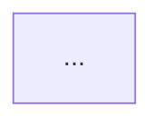

# Dependency Checker

## Why this repo needs a dedicated skill

DevDigest is **5 separately-versioned packages, not a pnpm/npm workspace** — each has its own
`package.json` and lockfile (`server/`, `client/`, `reviewer-core/`, `e2e/`, `mcp-server/`). There
is no `workspace:*` protocol linking them, so:

- The same library can silently drift to different versions across packages (nobody catches this
  automatically — there's no shared lockfile to force it).
- "Internal dependency" doesn't mean an npm entry — it means a **TypeScript path alias** or a
  **relative import that reaches into another package's `src/`**, and MCP-server's link to the API
  is an HTTP call, not an import at all.
- `@devdigest/shared` (the Zod contracts) is **vendored**, not installed — a copy under
  `server/src/vendor/shared` and a separate copy in `client/`, kept in sync **by hand**. This is a
  drift risk with no tooling guardrail, which makes it worth checking every time.

Never describe these packages as linked by a monorepo/workspace mechanism — they aren't, and
recommendations that assume `workspace:*` resolution won't work here.

## Workflow

1. **Enumerate the 5 packages** — read each `package.json` (dependencies + devDependencies).
2. **Compute on-disk size** — run `scripts/analyze-deps.mjs <dir> <dir> ...` (pass all 5 package
   directories at once) with Bash. It shells out to `du` per direct dependency and returns JSON:
   per-package `node_modules` total, the top-10 heaviest direct deps, and — across all packages
   passed in — every dependency name installed at more than one distinct version (`drift`). This
   is deterministic bookkeeping; don't hand-roll it by eyeballing `package.json` files.
3. **Find unused dependencies** — for anything in the script's per-package dependency list, Grep
   the package's `src/` for the import specifier. A dependency declared but never imported is a
   removal candidate.
4. **Build the internal dependency graph** — Grep for cross-package signals: path-alias imports
   (e.g. `@shared/...`), relative imports that climb out of a package's own `src/` into another
   package's `src/` (these bypass that package's public entry point — flag them, they're a
   maintenance hazard even if they work today), and HTTP-client calls from `mcp-server` to the API.
   This step needs judgment, not a script — the point is *how* packages actually reach each other,
   which a pure import-graph tool would mislabel as "just another npm dependency."
5. **Diff the vendored shared copies** — `diff -rq server/src/vendor/shared client/src/vendor/shared`
   (adjust paths if the client copy lives elsewhere). Any difference is drift between hand-synced
   copies and belongs in the report regardless of its size.
6. **Check for outdated/vulnerable versions** — run `pnpm outdated` and `pnpm audit` inside each
   package directory. These hit the npm registry by nature (that's what makes them meaningful,
   unlike a bundle-size lookup) — that's expected and fine.
7. Synthesize everything into the report below. **Always give the complete report — every
   section, including the rendered Mermaid block — in your response text, in full**, even when
   you also persist it to disk. A developer reading the conversation should never have to open a
   file to see what you found; "I wrote the report, here's a two-line summary" is not an
   acceptable substitute for the report itself.
8. Only if you actually gathered the data yourself from the real repo (not data handed to you
   inline in the prompt), also write the same content to **`docs/dependency-report.md`**,
   overwriting any previous version — it's a point-in-time snapshot, not a changelog. Skip this
   step when the underlying data was synthetic or supplied by the user rather than read from disk;
   don't create a file that looks like a real analysis when it isn't one.

If you don't have tool access (e.g. the data was already handed to you inline), skip straight to
step 7 and reason over what you were given — don't ask for re-collection of data you already have,
and don't attempt to write a file in that case.

## Severity tiers

Every finding in "Findings & Priorities" gets exactly one tier — no unranked bullets:

- **P0** — actively wrong or risky: a known-vulnerable version, an internal import that bypasses
  a package's public entry point, or vendored `shared` copies that have actually diverged.
- **P1** — costs real size or maintenance burden today: heavy dependencies with a much lighter
  equivalent, an unused dependency still being installed, meaningful version drift on a
  frequently-touched library (e.g. `zod`, `typescript`).
- **P2** — worth doing but low urgency: minor version drift on a rarely-touched dep, small
  bundle-size wins, outdated-but-not-vulnerable minor/patch bumps.
- **Info** — observations with no action attached (e.g. "reviewer-core has the smallest dependency
  footprint by design, consistent with its pure-engine role").

## Report structure

ALWAYS use this exact template — developers scanning the report rely on these section names
being stable across runs:

```markdown
# Dependency Report — <date>

## Scope
<which of the 5 packages were analyzed, and what was explicitly out of scope (e.g. "e2e's
Playwright browser binaries were excluded from size totals")>

## Dependency Graph

<the graph must distinguish external npm deps from internal path-alias/relative-import links —
e.g. solid edges for internal code dependencies between the 5 packages, and a separate subgraph
or dashed style for notable external dependencies. Don't draw every transitive npm dependency —
that's unreadable past ~20 nodes; collapse external deps to the heaviest few per package.>

## Size Breakdown
<one table per package (or one combined table with a "package" column): dependency name,
declared/installed version, on-disk size. Sort heaviest first. Include each package's total
node_modules size as a subtotal row.>

## Findings & Priorities
<every finding tagged P0/P1/P2/Info, each naming a specific package + dependency/file — never a
generic "consider optimizing dependencies". Group by tier, P0 first.>

## Summary
<3-5 concrete, ordered-by-priority takeaways a developer can act on today. Phrase each as a
recommendation for the developer to confirm ("consider removing X from Y") — you are reporting
findings, not executing a removal or upgrade yourself.>
```

## Common pitfalls this skill exists to catch

- Treating a path-alias import (`@shared/review-types`) or a relative cross-package import the
  same as an npm dependency — they need separate visual and textual treatment.
- Calling this a monorepo, or recommending `workspace:*` — it isn't one.
- Producing an unranked list of observations instead of tiered, named findings.
- A vague recommendation ("clean up dependencies") instead of one that names the exact package
  and file.
- Skipping the vendored-`shared`-drift check because it "isn't really a dependency" — it's the
  highest-risk drift in this repo precisely because nothing automated catches it.