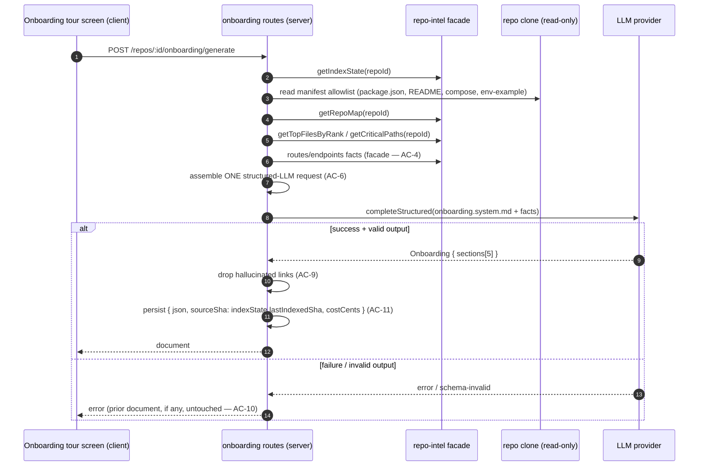
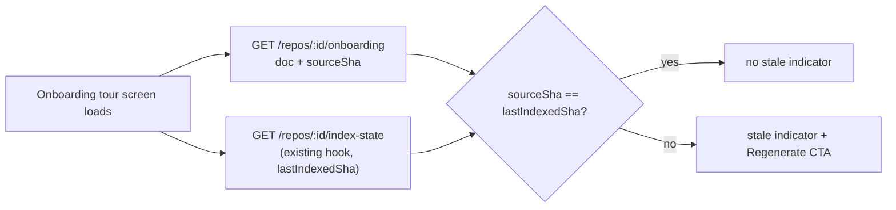

# Spec: Onboarding generator  |  Spec ID: SPEC-01  |  Status: draft
Supersedes: none
Implementation Plan: not yet planned

> Lesson L05, item 2 of 3 ("Onboarding generator"). The other two L05 items —
> Project Context Folder (`server/specs/SPEC-01-project-context.md`, already
> drafted) and PR Brief card — are separate features and out of scope here.

## Проблема й навіщо

A developer opening an unfamiliar repo in DevDigest today has the diff viewer,
Blast Radius, and (once built) Project Context — all tools for reviewing a
*specific* PR, none of which answer the much earlier question a new
contributor actually has: "what is this codebase, how is it put together, and
where do I start reading and working?" Today that answer lives only in a
teammate's head or a stale onboarding doc nobody maintains.

**Onboarding generator** turns the facts DevDigest already has cheaply
available — the persisted repo-intel index (repo map, import-graph rank,
critical paths) plus a handful of manifest files — incto a five-section,
first-day tour for the repo: Tech Stack, Architecture, Routes & APIs, Reading
Path, and First Tasks. It is generated by exactly one structured LLM call, is
persisted per repo, can be regenerated on demand, and is viewable at a stable,
shareable in-app URL.

### What already exists (grounding — audited in the repo)

This feature is mostly *wiring pre-existing scaffolding*, the same shape as
`SPEC-01-project-context.md`:

- The `onboarding` table already exists (`server/src/db/schema/context.ts`):
  `{ repoId (PK), json (jsonb), generatedAt }` — one row per repo, currently
  never written to.
- The full LLM output contract already exists in the vendored shared contracts
  (`contracts/knowledge.ts`): `Onboarding { sections: OnboardingSection[] }`,
  `OnboardingSection { kind, title, body (markdown), diagram (mermaid,
  nullish), links: OnboardingLink[] }`, `OnboardingLink { label, path }`.
- The system prompt already exists: `server/src/prompts/onboarding.system.md`.
  It already declares "Produce EXACTLY these sections, in this order:
  `{{sections}}`", already restricts a non-null `diagram` to the `architecture`
  and `routes_and_apis` section kinds, already carries an inline SECURITY
  clause treating `<untrusted>…</untrusted>` blocks as data, and already
  forbids inventing file paths/scripts/routes/dependencies not present in the
  supplied facts. This spec fixes what `{{sections}}` resolves to; it does not
  need to rewrite the prompt's existing rules.
- `'onboarding'` is already a registered `FeatureModelId`
  (`contracts/platform.ts`), with a default of `openrouter` /
  `deepseek/deepseek-v4-flash`, resolvable today via the existing
  `resolveFeatureModel(container, workspaceId, 'onboarding')` helper — exactly
  the call the `conventions` module already makes for its own single
  structured LLM call (`server/src/modules/conventions/service.ts`).
- The repo-intel facade already exposes, and already comments as built FOR
  this feature: `getTopFilesByRank(repoId, n, opts)` and `getCriticalPaths(repoId)`
  (`server/src/modules/repo-intel/service.ts` — doc comment: "T3: onboarding
  reading-path + critical paths"), plus `getRepoMap(repoId)` for the compact
  repo skeleton. All are pure reads over the already-computed persistent index
  — no new indexing work.
- `rank.ts` computes `rank = pagerank`, `hotness = 0` (Option B — the clone is
  shallow, `CLONE_DEPTH = 1`, so there is no churn window). The Reading Path
  section is therefore **import-graph-rank-derived ordering**, not
  hotness-weighted, and this spec writes its acceptance criteria to match that
  reality rather than describing behavior the engine doesn't have.
- Client rendering infrastructure already exists and needs no new dependency:
  `client/src/vendor/ui/primitives/Markdown.tsx` (markdown body) and
  `client/src/components/mermaid-diagram/MermaidDiagram.tsx` (mermaid
  `diagram` strings) — the same primitives the Project Context Preview panel
  uses. `client/src/lib/hooks/repo-intel.ts` already exposes a hook for
  `GET /repos/:id/index-state` → `RepoIntelState.lastIndexedSha`, which the
  staleness check (AC-14) reuses as-is.
- Nothing server-side currently reads/writes the `onboarding` table, calls the
  `onboarding.system.md` prompt, or resolves the `'onboarding'` feature model —
  there is no `modules/onboarding/` today. The gap is a service + two routes +
  a client screen, not new engine or contract work.

### Gap surfaced during design (non-blocking, flagged for the Implementation Plan)

The repo-intel facade's `RepoIntel` interface (`types.ts`) has no repo-wide
("give me every extracted API endpoint/cron in this repo") accessor today —
`getBlastRadius`'s endpoint/cron facts are scoped to a PR's *changed* files,
not the whole repo. Whether the Routes & APIs section is fed by a new
facade method, or derived from `getRepoMap`'s existing skeleton text plus the
manifest allowlist, is an implementation-planner decision — either way, this
spec's requirement is only that the source is the repo-intel facade (already
computed, zero new indexing), never an ad hoc full-tree file read.

## Goals / Non-goals

### Goals
- Generate, from exactly **one structured LLM call**, a five-section
  developer tour per repo: **Tech Stack**, **Architecture**, **Routes &
  APIs**, **Reading Path**, **First Tasks** — in that fixed order.
- Ground Tech Stack in a small fixed manifest-file allowlist (`package.json`,
  `README`, `docker-compose*`, `.env.example`) read directly from the clone.
- Ground Architecture, Routes & APIs, and Reading Path entirely in the
  persisted repo-intel index via the facade (repo map, import-graph rank,
  critical paths) — never a full file-tree read, regardless of repo size.
- Let the First Tasks section be free-form LLM-suggested prose over the same
  gathered facts, with no additional deterministic grounding step.
- Persist one document per repo, together with the repo-intel index SHA active
  at generation time and the generation's LLM cost (logged in cents,
  server-side only).
- Let a user manually **Generate** (first time) and **Regenerate** (any time)
  the document on demand, against the repo's *current* persisted index —
  regenerate never triggers a repo-intel reindex/resync as a side effect.
- Surface staleness by comparing the document's stored generation-time index
  SHA against the repo's current index SHA, and let the user view the
  document at a stable, shareable, in-app (already-authenticated-session) URL.

### Non-goals (explicitly out of scope)
- **Project Context Folder and PR Brief card** — the other two L05 doc
  features; separate specs.
- **Hotness-weighted reading path.** `rank.ts` ships `hotness = 0` (Option B);
  re-enabling churn-based hotness weighting is a separate, later change this
  spec does not scope.
- **Generation history / versioning.** One document per repo; Regenerate
  overwrites it. No "diff against the last generation," no audit trail of
  prior tours.
- **Automatic / scheduled regeneration.** Generation and regeneration are both
  strictly user-triggered; nothing regenerates automatically when the index
  advances (staleness is surfaced, never auto-resolved).
- **In-app editing of the generated tour.** View-only, exactly like the
  Project Context Preview panel; to change the content, Regenerate.
- **Any embedding / RAG / pgvector work.** Zero new LLM calls beyond the one
  structured call per generation; zero embedding calls.
- **A new authentication/authorization system.** The share link is a stable
  in-app permalink inside the existing single-instance session model — no new
  unauthenticated/public read surface.
- **Size-threshold-based degradation.** The facade-plus-manifest-allowlist
  design already keeps input bounded regardless of repo size; no additional
  "large repo" special-casing is introduced.
- **Displaying cost in the UI.** Cost is logged (in cents) for operator
  observability only; it is never rendered in the Onboarding tour screen.

## User stories

- **US-1 (new contributor).** As a developer new to a repo, I open its
  Onboarding tour and read Tech Stack, an Architecture diagram, the Routes &
  APIs list, a recommended Reading Path (in order), and a handful of
  suggested First Tasks — so I ramp up without needing a teammate to walk me
  through it.
- **US-2 (first generation).** As a maintainer of a freshly-indexed repo, I
  open its Onboarding tab, see no tour exists yet, click **Generate**, and get
  the five-section tour back from one bounded LLM call.
- **US-3 (returning maintainer).** As a maintainer of a repo whose code moved
  on since the tour was generated, I see a stale indicator once the repo's
  index has advanced past the tour's generation-time index, and I click
  **Regenerate** to refresh it against the current index — without kicking off
  a full reindex.
- **US-4 (sharing).** As a maintainer, I copy the Onboarding tour's URL and
  send it to a teammate, who opens the exact same tour in their own session.
- **US-5 (operator).** As an operator, I want every generation's LLM cost
  logged in cents for later auditing, without that number ever appearing on
  the tour screen a newcomer reads.

## Acceptance criteria (EARS)

**Fact gathering (deterministic — facade + manifest allowlist only)**

- **AC-1** WHEN onboarding generation runs for a repo, the system **shall**
  gather Tech Stack facts by reading a fixed allowlist of manifest files
  directly from the repo clone (`package.json`, a `README` variant, a
  `docker-compose*` file, `.env.example`) and **shall not** perform a full
  file-tree read. *Verify: unit.*
- **AC-2** The system **shall** gather Architecture facts exclusively via the
  repo-intel facade's `getRepoMap(repoId)`. *Verify: unit.*
- **AC-3** The system **shall** gather Reading Path facts exclusively via the
  repo-intel facade's rank-derived accessors (`getTopFilesByRank` /
  `getCriticalPaths`), ordering strictly by the persisted import-graph rank —
  never alphabetically, never by file modification date, and never weighted
  by churn/hotness (see Non-goals). *Verify: unit.*
- **AC-4** The system **shall** gather Routes & APIs facts exclusively via the
  repo-intel facade (no ad hoc file reads beyond the AC-1 manifest allowlist).
  *Verify: unit.*
- **AC-5** WHERE the repo-intel index for a repo is degraded or disabled
  (`getIndexState(repoId).degraded` is true, or repo-intel is globally off),
  the system **shall** still generate the Tech Stack section from the AC-1
  manifest allowlist and **shall** render the Architecture, Routes & APIs, and
  Reading Path sections in an explicit empty/degraded state rather than
  fabricating content. *Verify: integration.*

**Single structured LLM call**

- **AC-6** The system **shall** produce all five sections (Tech Stack,
  Architecture, Routes & APIs, Reading Path, First Tasks) from exactly **one**
  structured LLM call per generation, using only the facts gathered under
  AC-1–AC-4 as its input — no per-section calls, no additional LLM or
  embedding calls anywhere in the generation. *Verify: unit.*
- **AC-7** The system **shall** generate the First Tasks section's suggested
  starter tasks as free-form prose from that same single call over that same
  gathered-fact input, with no dedicated deterministic grounding step beyond
  what AC-1–AC-4 already gathered for the other four sections. *Verify: unit.*
- **AC-8** The system **shall** permit a non-null mermaid `diagram` only on
  the Architecture and Routes & APIs sections; the Tech Stack, Reading Path,
  and First Tasks sections **shall** always carry a null `diagram`. *Verify:
  unit.*
- **AC-9** IF a generated section's `links[].path` does not match any path
  present in that generation's gathered facts, THEN the system **shall** drop
  that link rather than render a path the model may have invented. *Verify:
  unit.*
- **AC-10** IF the structured LLM call fails, or its output fails
  schema/link validation after retries, THEN the system **shall** leave any
  existing persisted document for that repo untouched, and **shall** report
  the failure reason to the caller instead of persisting an empty or partial
  document. *Verify: integration.*

**Persistence & staleness**

- **AC-11** WHEN a generation completes successfully, the system **shall**
  persist the five-section document together with (a) the repo-intel index
  SHA active at generation time (`getIndexState(repoId).lastIndexedSha`) and
  (b) the generation's measured LLM cost, converted to and stored as an
  integer number of cents. *Verify: unit.*
- **AC-12** The system **shall** keep exactly one document per `repoId`;
  Regenerate overwrites the prior document rather than appending a new
  version (see Non-goals — no generation history). *Verify: unit.*
- **AC-13** WHEN a user triggers Regenerate, the system **shall** re-run fact
  gathering (AC-1–AC-4) and the single LLM call (AC-6) against the repo's
  *current* persisted repo-intel index, and **shall not** trigger a repo-intel
  reindex/resync as a side effect. *Verify: integration.*
- **AC-14** The system **shall** compute a document's staleness by comparing
  its persisted generation-time index SHA against the repo's current
  `getIndexState(repoId).lastIndexedSha`; WHEN they differ, the system
  **shall** present a stale indicator inviting the user to Regenerate.
  *Verify: unit (comparison) + e2e (indicator).*
- **AC-15** The cost logged per generation (AC-11) **shall** be available only
  via server-side persistence/logs, and the Onboarding tour screen **shall
  not** render it anywhere in its UI. *Verify: unit (cost is persisted) +
  e2e (the tour screen's rendered output contains no cost figure).*

**Presentation (client)**

- **AC-16** The system **shall** present a repo-scoped Onboarding tour screen
  rendering the five sections in the fixed order (Tech Stack → Architecture →
  Routes & APIs → Reading Path → First Tasks), each section's `body` via the
  existing Markdown renderer and, where present, its `diagram` via the
  existing mermaid renderer. *Verify: e2e.*
- **AC-17** WHERE no document has ever been generated for a repo, the system
  **shall** render an empty state with a **Generate** call-to-action instead
  of an error. *Verify: e2e.*
- **AC-18** The system **shall** expose the Onboarding tour at a stable,
  bookmarkable, repo-scoped in-app URL (consistent with this app's existing
  `:repoId`-scoped route convention), such that opening that URL in another
  already-open session of the same local instance re-opens the same tour — no
  new unauthenticated or public route is introduced. *Verify: e2e.*
- **AC-19** The system **shall** provide a **Copy link** affordance on the
  Onboarding tour screen that copies that stable URL to the clipboard.
  *Verify: e2e.*
- **AC-20** The system **shall** render a **Regenerate** action whenever a
  document already exists for the repo, and a **Generate** action instead
  WHERE none exists yet (AC-17). *Verify: e2e.*

## Edge cases

- **Repo never indexed / repo-intel disabled** — Tech Stack still generates
  from the manifest allowlist; Architecture/Routes & APIs/Reading Path degrade
  to an explicit empty state (AC-5), not a thrown error.
- **Generation LLM call fails or produces invalid output** — no document is
  written or overwritten; a prior document (if any) remains exactly as it
  was; the caller sees the failure reason (AC-10).
- **Concurrent Regenerate clicks for the same repo** — no locking is
  introduced; whichever generation completes last wins (last-write-wins),
  consistent with the single-row-per-repo persistence model (AC-12).
- **Very large manifest file** (e.g. a `package.json` with hundreds of
  dependencies, a very long `README`) — each manifest read is bounded/
  truncated so a single oversized file cannot blow up the prompt, mirroring
  the existing `conventions` module's bounded config-file reads.
- **Repo with an empty or degenerate import graph** (no edges) — Reading Path
  renders an explicit empty state rather than a fabricated order (the
  repo-intel facade already degrades this way — `getCriticalPaths` returns
  `[]` on an empty edge set).
- **Hallucinated link path** — dropped per-link rather than failing the whole
  section (AC-9).
- **Document requested for a repo with no generation yet** — the GET returns
  a "not generated" state; the screen shows the empty state (AC-17), not a
  404.
- **Index advances after generation but before the user notices** — the
  document stays fully viewable and accurate to its own generation time; only
  the stale indicator changes (AC-14), the content is never hidden or altered
  until Regenerate is explicitly triggered.
- **Repo deleted** — the `onboarding` row cascades with the repo (existing FK
  `onDelete: 'cascade'`).

## Non-functional

- **Performance.** Fact gathering is a bounded set of facade reads plus a
  fixed-size manifest allowlist — never a full file-tree walk, regardless of
  repo size (AC-1–AC-4). Each manifest file read is truncated to a bounded
  size, mirroring the existing `conventions` module's `MAX_CONFIG_LINES`-style
  caps, so prompt size stays bounded even for very large manifests. Exactly
  one LLM call per generation (AC-6) — no per-section calls, no embeddings.
- **Security.** Manifest file contents and repo-intel-derived facts are
  attacker-influenceable text (anyone who can land a commit on the indexed
  branch controls them) — the same class of concern as Project Context /
  Conventions; consult the `security` skill. See **Untrusted inputs** below.
- **Accessibility (client).** Mermaid diagrams need the same accessible
  fallback the existing `MermaidDiagram` component already provides;
  Generate/Regenerate/Copy-link controls need accessible labels; all
  user-facing strings go through next-intl, per `client/AGENTS.md`.
- **Observability.** Each generation must log (server-side): tokens in/out,
  cost in cents (AC-11), the generation-time index SHA, and success/failure
  with a reason on failure — so an operator can audit spend and reproduce a
  staleness decision after the fact. Note: this deliberately stores cost as
  integer **cents** on the `onboarding` document, diverging from this repo's
  existing `agent_runs`/`ci_runs`/`eval_runs` convention of a `cost_usd`
  double-precision column — an explicit, confirmed product decision for this
  feature, not an oversight; don't "fix" it to match the other tables.

## Workflow & Contracts

### Generate / Regenerate

### Staleness check (page load)

### Contracts (grounded in existing code)

- **`Onboarding` / `OnboardingSection` / `OnboardingLink`** (existing,
  `contracts/knowledge.ts`) — the LLM output shape; unchanged by this spec.
  This spec fixes `kind` to exactly five values (Tech Stack, Architecture,
  Routes & APIs, Reading Path, First Tasks, in that order) and confirms the
  existing prompt's diagram restriction (`architecture` /
  `routes_and_apis` only) matches AC-8.
- **`onboarding` table** (existing, `server/src/db/schema/context.ts`):
  `{ repoId (PK), json, generatedAt }`. This spec requires two net-new
  columns to satisfy AC-11/AC-14 — a generation-time index SHA and an integer
  cost-in-cents — exact column naming is an implementation-planner decision.
- **`FeatureModelId: 'onboarding'`** (existing, `contracts/platform.ts`,
  default `openrouter` / `deepseek/deepseek-v4-flash`) — reused as-is via the
  existing `resolveFeatureModel` helper, same call shape the `conventions`
  module already makes.
- **Prompt template** (existing, `server/src/prompts/onboarding.system.md`,
  `{{sections}}`/`{{language}}` placeholders) — reused as-is; no rewrite
  required by this spec.
- **repo-intel facade** (existing, `RepoIntel` interface, `types.ts`):
  `getIndexState`, `getRepoMap`, `getTopFilesByRank`, `getCriticalPaths` reused
  as-is. A repo-wide (non-diff-scoped) endpoints/crons accessor for the
  Routes & APIs section (AC-4) may be net-new on this interface — see "Gap
  surfaced during design" above; exact shape is an implementation-planner
  decision.
- **New server routes** (mirroring the existing `conventions` module's
  route triad): `GET /repos/:id/onboarding` → document + generation-time SHA
  (+ staleness computed client-side against the existing `GET
  /repos/:id/index-state`, or server-computed — planner's call); `POST
  /repos/:id/onboarding/generate` → runs Generate/Regenerate (AC-6–AC-13).
- **Client** — a new repo-scoped route/screen reusing
  `client/src/vendor/ui/primitives/Markdown.tsx` and
  `client/src/components/mermaid-diagram/MermaidDiagram.tsx`; reuses the
  existing `client/src/lib/hooks/repo-intel.ts` index-state hook for the
  staleness comparison (AC-14) and the existing `useActiveRepo()` /
  `:repoId`-scoped routing convention for the shareable URL (AC-18).

## Inputs (provenance)

- Manifest-allowlist reads (Tech Stack facts): **[deterministic: fixed-file
  read from the repo clone]**.
- Architecture / Reading Path / Routes & APIs facts: **[reused:
  repo-intel facade]** — the persisted index, already computed; zero new
  indexing work triggered by generation or regeneration.
- The five generated sections (body/diagram/links prose): **[new: 1 LLM call
  per generation]**, using the already-registered `'onboarding'`
  `FeatureModelId` and the already-existing `onboarding.system.md` prompt.
- Staleness comparison, cost logging, persistence: **[deterministic: DB
  read/write + the existing `getIndexState` facade call]** — no model
  involvement.

## Untrusted inputs

The manifest files and repo-intel-derived facts fed into the single LLM call
are external, attacker-influenceable text: anyone who can land a commit on the
repo's indexed branch can shape what `package.json`, `README`, the repo map,
or the ranked file list say — including content crafted to make the model
emit misleading "first tasks" (e.g. a suggested setup step that is actually a
malicious command) or to otherwise steer the generated tour. This is the same
class of prompt-injection surface already handled for Conventions/Project
Context, and it carries an extra wrinkle here: the *output* is a human-facing
document a new contributor may act on directly (e.g. copy-paste a suggested
first-task command), so a poisoned suggestion has a more direct path to being
executed than a review finding does.

Mitigation (grounded in existing behavior; consult the `security` skill):
- `server/src/prompts/onboarding.system.md` already declares that content
  inside `<untrusted>…</untrusted>` blocks is DATA to analyze, never
  instructions, and already forbids inventing paths/scripts/routes/deps not
  present in the supplied facts — this spec requires every gathered raw-text
  fact (manifest contents, repo map text) to be wrapped accordingly before
  assembly, consistent with what the prompt already expects.
- AC-9's link validation (drop any `links[].path` not present in the gathered
  facts) is a code-side backstop against path hallucination, not just a
  prompt instruction.
- The First Tasks section is prose for a human to read and decide on — this
  spec does not introduce any mechanism that executes, schedules, or
  auto-runs anything derived from a generated section. That boundary is worth
  stating explicitly precisely because "first tasks" reads like actionable
  instructions to a newcomer.
- No new secrets, no new write scope, no new outbound calls — generation only
  reads the already-cloned repo and calls the LLM provider already configured
  for reviews.

## [NEEDS CLARIFICATION]

- **Exact facade surface for Routes & APIs facts.** Whether a new repo-wide
  facade method is added, or the section is derived from `getRepoMap` plus the
  manifest allowlist, is left to the Implementation Plan (see "Gap surfaced
  during design"). Non-blocking — either satisfies AC-4's "facade only, no
  ad hoc full-tree read" requirement.
- **Regenerate concurrency.** Defaulting to no locking / last-write-wins
  (edge case above). Confirm if a stricter guarantee (reject a second
  in-flight Regenerate) is ever needed. Non-blocking.
- **Exact manifest filename variants matched** (e.g. `README` vs `README.md`
  vs lowercase, which `docker-compose*` globs). Defaulting to the same
  case-insensitive/common-variant matching style already used by the
  `conventions` module's `CONFIG_FILE_CANDIDATES` list. Non-blocking —
  implementation-planner detail.
