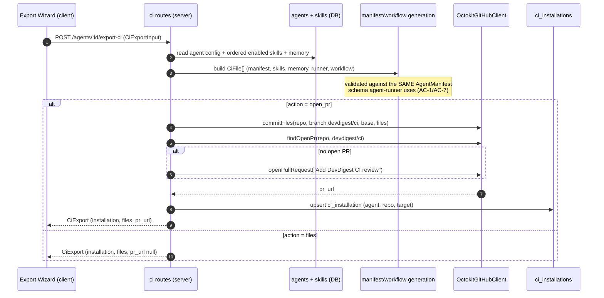

# Spec: Export to CI  |  Spec ID: SPEC-04  |  Status: draft
Supersedes: none
Implementation Plan: `specs/plans/PLAN-04-export-to-ci.md`

> Lesson **«Частина 3 — Export to CI: агент їде туди, де живуть справжні PR»**.
> This is the feature that takes an agent the user has already tuned locally and
> makes it run **by itself** on real pull requests in the target repo's own
> GitHub Actions.
>
> **Numbering note.** The repo-root `specs/` directory already holds three spec
> ids: `SPEC-01` (`SPEC-01-onboarding-generator.md`), `SPEC-02`
> (`SPEC-02-pr-why-risk-brief.md`) and **`SPEC-03` — claimed by
> `specs/eval-pipeline.md`, whose file name lacks the `SPEC-NN-` prefix but whose
> header declares `Spec ID: SPEC-03`**. To keep `AC-N` traceability keyed to a
> unique id, this feature takes the next free id, **SPEC-04**, rather than
> colliding with the Eval Pipeline spec — which itself lists "CI export / GitHub
> Action generation" as an explicit non-goal and defers the `eval-ci.ts`
> contracts to exactly this spec.

## Existing building blocks (do not redesign)

Earlier phases already built most of the hard parts. This spec **references them
as given infrastructure**; nothing below is re-derived, re-designed, or
re-specified here.

| # | Block | State | Where |
|---|---|---|---|
| 1 | **`agent-runner/` (`@devdigest/agent-runner`)** — standalone CLI, `ncc`-bundled to `dist/index.js`, embedded as `.devdigest/runner/index.js` in the target repo and run by that repo's own Actions. Reads `.devdigest/agents/<slug>.yaml` + `.devdigest/skills/*.md` from the working tree, fetches the PR diff via GitHub REST (native `fetch`), runs the **exact** `reviewer-core` pipeline (`assemblePrompt`/`wrapUntrusted`/`groundFindings`/deterministic verdict), posts `github_review`\|`pr_comment`\|`none`, writes `devdigest-result.json` (`CiResultArtifact`), exits non-zero **iff** the deterministic `ci_fail_on` gate triggered `REQUEST_CHANGES`. Reads `OPENROUTER_API_KEY`/`GITHUB_TOKEN`/`GITHUB_REPOSITORY`/`PR_NUMBER`/`DEVDIGEST_POST_AS` straight from `process.env` — correct for its context; there is no DI graph in someone else's CI. | ✅ COMPLETE | `agent-runner/src/{index,run,manifest,github,diff,artifact,skills,context,errors}.ts`; `agent-runner/CLAUDE.md`; `agent-runner/README.md` |
| 2 | **Shared Zod contracts** — `CiTarget`, `CiFile`, `AgentManifest`, `CiExportInput` (request body of `POST /agents/:id/export-ci`), `CiInstallation`, `CiExport`, `CiRunStatus`, `CiRun`, `CiResultArtifact`. Treated as **fixed**; the gaps found are recorded in `[NEEDS CLARIFICATION]`, not silently patched. `@devdigest/shared` is **vendored, not published** — `server/src/vendor/shared/**` also serves `reviewer-core` **and** `agent-runner`; `client/src/vendor/shared/**` is a hand-mirrored copy. | ✅ COMPLETE | `server/src/vendor/shared/contracts/eval-ci.ts:283-389`; mirror `client/src/vendor/shared/contracts/eval-ci.ts` |
| 3 | **DB schema, already migrated** (`0000_init.sql`) — `ci_installations` (id, agent_id→agents, repo, target_type, installed_at), `ci_runs` (id, ci_installation_id, pr_number, ran_at, status, findings_count, cost_usd, github_url, source). Plus `agents.ci_fail_on` (`never\|critical\|warning\|any`, default `critical`), already wired through agents CRUD, and `agent_runs.source` (`local\|ci`, default `local`) — the general run-observability table behind Stats/Performance, separate from `ci_runs`. | ✅ COMPLETE | `server/src/db/schema/ci.ts`; `server/src/db/schema/agents.ts:25-27`; `server/src/db/schema/runs.ts:8-34`; `server/src/modules/agents/{routes,service,helpers}.ts` |
| 4 | **GitHub write adapter** — `OctokitGitHubClient implements GitHubClient` (PAT auth, canonical `GITHUB_TOKEN` with `GITHUB_PAT` fallback, **never** a GitHub App). Already has everything the export needs: `commitFiles(repo, {branch, base, files, message})` (tree+commit layered on the parent tree, creates *or* force-updates the ref, so unrelated files survive), `openPullRequest`, `findOpenPr` (idempotency probe), `postReview`/`createReviewComment`. **Do not design a new GitHub client.** | ✅ COMPLETE | `server/src/adapters/github/octokit.ts:245-349`; interface in `server/src/vendor/shared/adapters.ts` |
| 5 | **`ExportWizardSteps`** — generic horizontal numbered step indicator (done/current/upcoming), already used by other export/publish wizards. Reuse for the 4-step header. | ✅ COMPLETE | `client/src/vendor/ui/ExportWizardSteps.tsx` |
| 6 | **Client stubs** — the nav-route matcher already returns `"ci-runs"` for `/ci-runs`, and the i18n labels `shell.nav.ci-runs = "CI Runs"` and `agents.editor.tabs.ci = "CI"` already exist. Missing: the `/ci-runs` page itself, the sidebar `NavItemDef` (`client/src/vendor/ui/nav.ts` has **no** `ci-runs` entry — its `key` must match `"ci-runs"` exactly, see Edge cases), and the `ci` entry in `AgentEditor`'s `TABS`. | ⚠️ PARTIAL | `client/src/components/app-shell/helpers.ts:38`; `client/messages/en/shell.json:28`; `client/messages/en/agents.json:46-53`; `client/src/vendor/ui/nav.ts`; `client/src/app/agents/[id]/_components/AgentEditor/constants.ts` |

## Проблема й навіщо

An agent the user has tuned in the studio is **useless to their team while it
only exists on their machine**. Every review is a manual act: open DevDigest,
pick the PR, press Run. Close the studio and the agent stops existing for
everyone else.

Deploying it to CI is the point at which the tool stops being personal and
becomes **shared infrastructure**: it runs on every PR, for every contributor,
without anyone remembering to invoke it.

The non-negotiable design goal is **one contract, two consumers**. A "tuned
agent" is technically just a configuration — model + system prompt + linked
skills + settings. Export serializes exactly that into a manifest
(`.devdigest/agents/<slug>.yaml`), and that manifest is validated by **the same
Zod schema** in the studio and in `agent-runner`. There is no "CI runs a slightly
different prompt": it is the same artifact, byte for byte, through the same
`reviewer-core` pipeline. Comparing a CI run against a local run of the same diff
must be comparing **two environments**, never two agents.

The second reason this feature is delicate is security, and it is a *new* risk
class for DevDigest. Locally the reviewer read an untrusted diff but had no
outbound channel. In CI the lethal trifecta closes: the agent reads untrusted
content (the diff, the PR body, PR comments), holds a credential, and has write
access to a public PR. Hence: minimal workflow permissions, no secrets for fork
PRs, and an export that lands as a **pull request that gets reviewed** rather
than a direct push to `main`.

## Goals / Non-goals

**Guiding principle: simplest workable version, not the most polished one.**
Every choice below and every resolved `[NEEDS CLARIFICATION]` item picks the
option that gets a real PR reviewed by a real CI run with the least new
machinery — no webhook receiver, no repo picker, no round-trip YAML sync, no
conditional permission generation. Iterate once real usage shows what's
actually missing.

### Goals

- Turn a configured agent into a **self-contained, checked-in CI bundle**: the
  manifest, its skill bodies, `.devdigest/memory.jsonl`, the bundled runner, and
  a generated `.github/workflows/devdigest-review.yml`.
- Guarantee **manifest parity**: what the studio writes is exactly what
  `agent-runner` validates and runs — same Zod schema, no CI-only rewriting.
- Ship the export as a **pull request on a `devdigest/ci` branch**, never a
  direct write to the base branch — the reviewer's own config gets reviewed like
  any other code.
- Generate a workflow that is **auditable line by line**: minimal permissions,
  secrets from Actions Secrets only, no fork-PR secret exposure, and **no
  external marketplace action** — the runner travels in the same PR and the job
  executes it directly.
- Give the user a **4-step Export Wizard** (Target → Preview → Configure →
  Install) that previews every file before anything is committed.
- Give the agent page a **CI tab**: where it is installed, with what status, and
  the "Fail CI on" gate selector.
- Give the studio a **CI Runs page**: the runs that came back *from* GitHub —
  the artifact ingested into the local DB, so the lab can see its graduate.
- Make **merge blocking** achievable with **no GitHub App**: `ci_fail_on` →
  deterministic `REQUEST_CHANGES` → non-zero exit → a required status check in
  the repository's own branch protection.

### Non-goals (explicitly out of scope)

- **Producing an Implementation Plan.** This spec is WHAT/WHY only; the
  file-by-file build order belongs to `implementation-planner`.
- **Redesigning any of the six building blocks above.** In particular
  `agent-runner`'s internals, the `eval-ci.ts` contracts, the `ci_*` tables and
  `OctokitGitHubClient` are consumed as-is.
- **Making CircleCI / Jenkins / Generic-CLI actually work.** They exist in the
  Target step as selectable options; **GitHub Actions is the only target that
  must work end-to-end** in this iteration.
- **The multi-agent-run service and the PR review feed.** Worktree-B boundary:
  this feature adds the `ci` engine + its routes, the CI Runs page and the agent
  CI tab. It does not enter multi-run orchestration or the PR feed.
- **The agent page's Stats tab.** The screenshots show `Config / Skills / Context
  / Evals / Stats / CI`; only **CI** is in scope (an existing i18n key for
  `stats` is not a mandate to build it).
- **A GitHub App, an OAuth flow, or any new auth mechanism.** PAT only, via the
  existing adapter; merge blocking comes from branch protection, not an
  app-owned check run.
- **Creating, rotating, or verifying the target repo's Actions Secrets.**
  DevDigest never creates `OPENROUTER_API_KEY` in the target repo — the user does
  that by hand (AC-31).
- **Consuming `.devdigest/memory.jsonl` at review time.** It is exported so the
  bundle is complete and forward-compatible, but `agent-runner` does not read it
  today (grep-confirmed: no memory reader in `agent-runner/src/**`). Memory
  arrives as a later exercise.
- **A background scheduler or webhook receiver for CI runs.** Ingest is a
  user-triggered refresh in this iteration; no `workflow_run` webhook endpoint is
  built.
- **Bulk-updating the runner bundle across all installed repos.** Bumping an
  installed repo means re-running the wizard for that repo.

## User stories

- **US-1 (deploy).** As a studio user with a tuned agent, I press **+ Add to CI**
  on the agent's CI tab, walk four steps, and DevDigest opens a PR in my repo
  containing everything needed to run that agent on future PRs.
- **US-2 (see before you commit).** As a security-minded user, I read every
  generated file in the Preview step — especially the workflow YAML — and can
  explain each line before anything is committed anywhere.
- **US-3 (choose the gate).** As a user, I pick the triggers and how results are
  posted (GitHub review / PR comment / exit code only), and I am told plainly
  that only a GitHub review carries a verdict, and what else I must do to block
  merges.
- **US-4 (review the reviewer).** As a repo maintainer, I get a normal PR on a
  `devdigest/ci` branch, review it like any other change, and merge it — nothing
  was pushed into `main` behind my back.
- **US-5 (it just runs).** As a contributor, I open a PR and within a minute or
  two the agent's structured findings appear on it, produced by the same engine
  and prompt the studio uses locally.
- **US-6 (block the bad ones).** As a maintainer, I set **Fail CI on → critical**
  and, together with branch protection, a PR carrying a seeded CRITICAL finding
  cannot be merged — with no GitHub App installed.
- **US-7 (see it back home).** As a studio user, I open **CI Runs** and see runs
  that came from GitHub — PR, repo, agent, verdict, findings, cost, duration and
  a link to the Actions job — and the same run also appears on the agent's CI tab.
- **US-8 (fleet view).** As a user with the agent installed in several repos, the
  CI tab tells me where it is deployed and whether the latest run there succeeded.

## Acceptance criteria (EARS)

### A. Manifest & exported bundle — "one contract, two consumers"

- **AC-1** WHEN a user completes an export of agent *A*, the system **shall**
  serialize *A*'s live configuration — name, provider, model, system prompt,
  ordered enabled skill slugs, strategy, `ci_fail_on` — into a single YAML file
  at `.devdigest/agents/<slug>.yaml` that validates against the **same**
  `AgentManifest` Zod schema `agent-runner` validates with.
  *Verify: unit.*
- **AC-2** The system **shall** produce exactly **one** `*.yaml`/`*.yml` file
  under `.devdigest/agents/` per exported bundle; IF a repository already carries
  a DevDigest manifest and a new export targets that repository, THEN the export
  **shall** replace the existing manifest file rather than adding a second one —
  `agent-runner` hard-fails when that directory holds ≠ 1 manifest
  (`agent-runner/src/manifest.ts:36-44`).
  *Verify: unit + integration.*
- **AC-3** WHEN an exported manifest lists a skill slug, the system **shall** also
  emit that skill's body at exactly `.devdigest/skills/<slug>.md`, with the slug
  derived deterministically from the skill's name; IF two skills would derive the
  same slug, THEN the system **shall** disambiguate them so every entry in
  `skills[]` resolves to exactly one existing file (a missing skill file is a hard
  runner failure — `agent-runner/src/skills.ts:20-26`).
  *Verify: unit.*
- **AC-4** The system **shall** include `.devdigest/memory.jsonl` in every
  exported bundle; WHERE the workspace/repo has no memory entries it **shall**
  emit an empty file rather than omitting the file or failing.
  *Verify: unit.*
- **AC-5** The system **shall** include the bundled runner at
  `.devdigest/runner/index.js`, flagged `editable: false` in the returned
  `CiFile[]`, so the generated workflow executes a runner that travelled in the
  same pull request.
  *Verify: unit.*
- **AC-6** The system **shall not** write any secret value — LLM API key, GitHub
  token, or any value read through the `SecretsProvider` — into any generated
  file, into the `CiExport` response, or into any log line emitted by the export
  path.
  *Verify: unit.*
- **AC-7** WHEN the generated manifest YAML is fed back through `agent-runner`'s
  own loader, the system **shall** yield a manifest equal to the exported agent's
  configuration field-for-field — i.e. the export **shall not** apply any CI-only
  transformation to the system prompt, skill bodies, model or gate.
  *Verify: unit (round trip: generated YAML → `loadAgentManifest` → deep-equal).*

### B. Generated GitHub Actions workflow

- **AC-8** The system **shall** generate `.github/workflows/devdigest-review.yml`
  whose review step executes the bundled runner directly (`node
  .devdigest/runner/index.js`), and **shall not** emit any reference to an
  external marketplace review action — the mockup's `uses:
  devdigest/review-action@v1` is a placeholder and must never appear in generated
  output.
  *Verify: unit (assert on the generated YAML string).*
- **AC-9** The system **shall** generate an `on: pull_request:` trigger whose
  `types` are exactly the triggers selected in the Configure step (default
  `opened` + `synchronize`; `reopened` optional).
  *Verify: unit.*
- **AC-10** The generated workflow **shall** declare a fixed `permissions:` block
  of exactly `contents: read`, `pull-requests: write` and `issues: write`, always
  — regardless of the `post_as` choice — and **shall not** declare any broader or
  speculative scope. (`issues: write` is included unconditionally, not only when
  `post_as: pr_comment` is selected, because posting via the issue-comments
  endpoint needs it and a fixed three-line block is simpler to generate and audit
  than branching the permissions block per `post_as` — resolves `[NEEDS
  CLARIFICATION]` 13 with the simplest option. Declaring any `permissions:` key
  sets every unlisted scope to `none`, so this block *is* the deny-by-default
  boundary; `actions/upload-artifact` authenticates with the separate Actions
  runtime token, so AC-15 needs no extra scope.)
  *Verify: unit.*
- **AC-11** The generated workflow **shall** trigger on `pull_request` and
  **shall not** use `pull_request_target` — the latter runs fork PRs with the base
  repository's full-permission token *and* its secrets, which is exactly the
  escalation this feature must avoid.
  *Verify: unit.*
- **AC-12** IF a pull request's head branch comes from a fork, THEN the generated
  workflow **shall** skip the review job explicitly rather than let it start.
  Rationale (verified against GitHub's docs): on a fork `pull_request` run,
  `secrets.GITHUB_TOKEN` is still populated but **read-only**, and every other
  repository/organisation secret is **withheld** — so an unguarded job would
  start, receive an empty `OPENROUTER_API_KEY`, and hard-fail on the first model
  call, producing a red check that looks like a blocking verdict but is an
  authentication error. The skip **shall** be observable as a skip, not a failure.
  *Verify: unit (generated-YAML guard) + manual (fork PR against a real repo).*
- **AC-13** The generated workflow's review **job name shall be stable** across
  re-exports of the same agent/repository, because GitHub matches a
  branch-protection *required status check* by job name — a job renamed by a
  later export would silently stop satisfying the required check and merges would
  no longer be blocked (US-6).
  *Verify: unit.*
- **AC-14** The generated workflow **shall** pass the runner every environment
  variable it requires — `OPENROUTER_API_KEY` from Actions Secrets,
  `GITHUB_TOKEN` from the workflow token, `GITHUB_REPOSITORY`, `PR_NUMBER`, and
  **`DEVDIGEST_POST_AS` set to the `post_as` chosen in Configure** — because
  `AgentManifest` carries no `post_as` field, so without this env var the runner
  silently defaults to `github_review` and the wizard's choice is lost (known
  gap, `agent-runner/insights/INSIGHTS.md` → Open Questions).
  *Verify: unit.*
- **AC-15** The generated workflow **shall** upload `devdigest-result.json` as a
  run artifact **even when the runner exits non-zero**, so a gate-blocked run is
  still ingestible by the studio.
  *Verify: unit (upload step runs on failure too) + manual.*
- **AC-16** The generated workflow **shall not** echo, print or otherwise emit any
  secret value into the job log.
  *Verify: unit.*
- **AC-17** The generated workflow **shall** be auditable as a whole: no step may
  fetch and execute code from a network location at run time beyond the pinned
  checkout action and the runner file committed in the same pull request.
  *Verify: unit + manual (a line-by-line read is US-2's explicit success test).*

### C. Export / install action (`POST /agents/:id/export-ci`)

- **AC-18** The system **shall** expose `POST /agents/:id/export-ci` accepting
  `CiExportInput` (`repo`, `target`, `action`, `post_as`, `triggers`, `base`) and
  returning `CiExport` (`installation`, `files`, `pr_url`).
  *Verify: integration.*
- **AC-19** WHEN `action` is `open_pr`, the system **shall** write **all**
  generated files in a single commit onto the branch `devdigest/ci` (based on
  `base`) and open a pull request titled *"Add DevDigest CI review"*, and **shall
  not** commit to `base` or to the repository's default branch directly.
  *Verify: integration (mock GitHub client).*
- **AC-20** IF an open pull request already exists for the `devdigest/ci` branch,
  THEN the system **shall** update that branch and return the existing PR's URL as
  `pr_url` instead of opening a second pull request.
  *Verify: integration.*
- **AC-21** WHEN `action` is `files`, the system **shall** return the generated
  `CiFile[]` with `pr_url: null` and **shall not** perform any GitHub write.
  *Verify: integration.*
- **AC-22** WHEN an export succeeds, the system **shall** record a
  `ci_installations` row for (agent, repo, target); WHEN the same agent is
  exported to the same repository again it **shall** update that installation
  rather than accumulate duplicate rows.
  *Verify: integration.*
- **AC-23** IF the GitHub write fails, THEN the system **shall** return the
  specific reason to the caller, **shall not** report the installation as
  successful, and **shall not** present a partially-written branch as a finished
  install. In particular, IF the configured token lacks permission to create or
  update a workflow file, THEN the surfaced message **shall** name that missing
  permission — GitHub rejects such a push outright ("refusing to allow a Personal
  Access Token to create or update workflow … without `workflow` scope"; the
  fine-grained-PAT equivalent is the *Workflows: write* repository permission,
  which is separate from *Contents: write*).
  *Verify: integration.*
- **AC-24** The export route **shall** be workspace-scoped: an agent id outside
  the caller's workspace **shall** be rejected rather than exported.
  *Verify: integration.*

### D. Export Wizard (client)

- **AC-25** WHEN a user activates **+ Add to CI** (or **Update CI config**) on an
  agent's CI tab, the system **shall** open a modal wizard with the four steps
  Target → Preview → Configure → Install, rendered with the existing
  `ExportWizardSteps` indicator; navigating Back and forward again **shall**
  preserve everything already chosen. The Target step **shall** collect the
  destination repository as a **plain free-text `owner/name` input** — not a
  picker scoped to repositories already imported into DevDigest — since
  `CiExportInput.repo` and the GitHub adapter (`commitFiles`/`openPullRequest`)
  already accept any `{owner, name}` and a picker adds UI + import-status
  plumbing this iteration doesn't need (resolves `[NEEDS CLARIFICATION]` 9 with
  the simplest option).
  *Verify: e2e.*
- **AC-26** The Target step **shall** offer four selectable targets — GitHub
  Actions (marked *recommended*), CircleCI, Jenkins, Generic CLI — each with a
  one-line description; WHERE a target other than GitHub Actions is selected, the
  wizard **shall** state that it is not available in this iteration and **shall
  not** produce an export that claims to have installed it.
  *Verify: e2e.*
- **AC-26a** WHEN the selected target repository already carries a DevDigest
  manifest for a **different** agent, the wizard **shall** surface an explicit
  warning naming that other agent before the Install step can be reached (e.g.
  "This repository already runs *Performance Reviewer* — installing *Security
  Reviewer* will replace it, since a repo can only run one DevDigest agent in
  CI"), and **shall** require an explicit confirmation before proceeding —
  resolves `[NEEDS CLARIFICATION]` 5 (the server-side replace behavior is AC-2;
  this is the client-side guard in front of it). Re-exporting the **same** agent
  into a repo it is already installed in is a normal update and **shall not**
  trigger this warning.
  *Verify: e2e.*
- **AC-27** The Preview step **shall** list every file the export will create —
  `.devdigest/agents/<slug>.yaml`, each `.devdigest/skills/*.md`,
  `.devdigest/memory.jsonl`, `.devdigest/runner/index.js` and
  `.github/workflows/devdigest-review.yml` — with the workflow selected by
  default, and **shall** show the selected file's contents in a code view marked
  editable for files whose `CiFile.editable` is true.
  *Verify: e2e.*
- **AC-28** WHERE a previewed file is `editable: false` (the runner bundle), the
  system **shall not** offer it for editing and **shall not** render its full
  minified contents in the code view.
  *Verify: unit/e2e.*
- **AC-29** WHEN the user edits an editable file's contents in Preview and then
  installs, the system **shall** commit the edited contents, not the originally
  generated ones.
  *Verify: e2e.*
- **AC-30** The Configure step **shall** offer trigger checkboxes
  (`pull_request:opened` and `pull_request:synchronize` checked by default,
  `pull_request:reopened` optional), a "Post results as" choice of *GitHub review*
  (recommended) / *PR comment* / *None — exit code only*, and a "Secrets expected"
  table listing `OPENROUTER_API_KEY` and `GITHUB_TOKEN` (noting Actions provides
  the latter automatically). The checkboxes **shall** be the only way to set
  triggers **one-way** into the generated `on:` block — the workflow file shown in
  Preview is separately hand-editable (AC-29), and the wizard **shall not**
  attempt to parse a hand-edited `on:` block back into checkbox state; the two are
  independent, not synced (resolves `[NEEDS CLARIFICATION]` 8 with the simplest
  option — no round-trip parser).
  *Verify: e2e.*
- **AC-31** The Configure step's secrets table **shall** be presented as the
  secrets the workflow *expects*, with an instruction to add missing ones manually
  before the workflow runs, and **shall not** assert that DevDigest has inspected
  the target repository's Actions Secrets — it does not.
  *Verify: e2e (copy assertion). See `[NEEDS CLARIFICATION]` 6.*
- **AC-32** The Configure step **shall** display a callout explaining that
  blocking merges requires setting **Fail CI on** (CI tab) so the run exits
  non-zero **and** adding a required status check in the repository's own branch
  protection, and that no GitHub App is needed.
  *Verify: e2e.*
- **AC-33** The Install step **shall** offer "Open a PR with these files"
  (recommended — naming the target repository, the PR title and the number of
  files) and "Copy files as a zip" as a degraded manual path, plus a link to the
  GitHub Action setup docs. "Copy files as a zip" **shall** be built entirely
  client-side from the `CiFile[]` array the wizard already fetched for Preview —
  including the runner bundle — with **no new server endpoint**; this is the
  simplest option that still yields a complete, working manual install (resolves
  `[NEEDS CLARIFICATION]` 7).
  *Verify: e2e.*
- **AC-34** WHEN an install succeeds via the PR path, the system **shall** surface
  the opened/updated pull request's URL to the user as the next action.
  *Verify: e2e.*
- **AC-35** Every user-facing string introduced by the wizard, the CI tab and the
  CI Runs page **shall** come from the next-intl message catalogue, and no status
  **shall** be conveyed by colour alone.
  *Verify: unit/manual.*

### E. Agent CI tab

- **AC-36** The agent editor **shall** expose a **CI** tab alongside Config /
  Skills / Context / Evals, showing a "CI deployment" header, a status pill
  reading how many repositories the agent is installed in, an **Update CI config**
  action and a primary **+ Add to CI** action.
  *Verify: e2e.*
- **AC-37** The CI tab **shall** list every installation of that agent — each row
  showing the repository, the target-type badge, the latest run's status and the
  relative time of that latest run — plus an affordance to install into another
  repository; WHERE the agent has no installations it **shall** render an empty
  state with the **+ Add to CI** call to action rather than an error.
  *Verify: e2e.*
- **AC-38** The CI tab **shall** expose the agent's **Fail CI on** selector
  (`never` / `critical` / `warning` / `any`) bound to the already-existing
  `agents.ci_fail_on` value.
  *Verify: integration + e2e.*
- **AC-39** WHEN a user changes **Fail CI on** — or any other configuration the
  manifest carries — after the agent has been exported, the system **shall**
  indicate that installed repositories keep running the previously exported
  manifest until the export is re-run, and **shall not** imply live repositories
  were updated.
  *Verify: e2e.*

### F. CI Runs page

- **AC-40** The system **shall** serve a `/ci-runs` page listing ingested CI runs,
  each row showing the PR, the repository, the agent, the verdict/status, the
  findings count, the cost, the duration and a link to the GitHub Actions job. The
  agent name and duration **shall** be read via `ci_runs.agent_run_id`'s join to
  `agent_runs` (`duration_ms`) and its agent, not stored redundantly on `ci_runs`
  — resolves `[NEEDS CLARIFICATION]` 3, and depends on the AC-47 FK.
  *Verify: e2e.*
- **AC-41** WHERE a listed value is genuinely unknown for a run (cost not reported
  by the provider, duration unavailable), the system **shall** render an explicit
  unknown marker rather than `0` or a fabricated value.
  *Verify: unit.*
- **AC-42** WHERE no CI runs have been ingested, the page **shall** render an
  empty state explaining how runs arrive (export → merge → open a PR), not an
  error.
  *Verify: e2e.*
- **AC-43** The system **shall** offer a user-triggered refresh that runs the
  ingest pass (section G) and updates the table, and **shall** show that a refresh
  is in progress while it runs.
  *Verify: e2e.*
- **AC-44** The `/ci-runs` route **shall** be reachable from the sidebar, with the
  nav item's key exactly `"ci-runs"` so it matches the already-wired active-route
  matcher.
  *Verify: unit.*

### G. Ingest — GitHub Actions → studio DB

- **AC-45** WHEN an ingest pass runs for an installation, the system **shall**
  list the target repository's workflow runs for the generated workflow file and,
  for each candidate run, download its `devdigest-result.json` artifact.
  *Verify: integration (stubbed GitHub API).*
- **AC-46** WHEN an artifact is downloaded, the system **shall** validate it with
  the `CiResultArtifact` Zod schema before any of its fields are persisted or
  rendered; IF validation fails THEN it **shall** skip that payload (recording the
  run as unusable) rather than persist unvalidated content.
  *Verify: unit.*
- **AC-47** WHEN a single ingest pass processes one workflow run, the system
  **shall** write **both** (a) a `ci_runs` row scoped to the `ci_installation`,
  carrying the display fields the CI Runs page and the CI tab read, **and** (b) an
  `agent_runs` row with `source='ci'` for that agent, so the unified
  observability/Stats views count CI runs alongside local ones — one pass, two
  destinations, never one without the other. The two rows **shall** be linked by a
  new nullable `ci_runs.agent_run_id` FK → `agent_runs.id`, written atomically in
  the same transaction, so the pair can never drift apart (resolves
  `[NEEDS CLARIFICATION]` 1(a)). `agent_runs.workspace_id` **shall** be taken from
  the installation's agent (1(c)); `agent_runs.provider`/`model` **shall** be
  copied from that agent's current config at ingest time, and `tokens_in`/
  `tokens_out` **shall** be left null — `CiResultArtifact` carries no token counts
  (1(b)).
  *Verify: integration (real Postgres, `.it.test.ts`).*
- **AC-48** `ci_runs` **shall** carry a new `workflow_run_id` column (GitHub's
  numeric run id), unique per `ci_installation`; WHEN the same workflow run is
  ingested more than once, the system **shall** look it up by that key and
  **update** the existing `ci_runs` row and its linked `agent_runs` row rather
  than create duplicates (resolves `[NEEDS CLARIFICATION]` 2 — `workflow_run_id`,
  not `github_url` or a composite key, since it is GitHub's own stable identifier
  for the run).
  *Verify: integration.*
- **AC-49** The system **shall** derive a run's persisted status from the
  workflow-run conclusion **combined with** the presence and content of the
  artifact — because the runner exits non-zero both when the deterministic gate
  blocked a PR (artifact present) and when it hard-failed (no artifact written at
  all — `agent-runner/src/run.ts:167-172`). A gate-blocked run **shall not** be
  recorded as an infrastructure failure, and a hard failure **shall not** be
  recorded as a successful review.
  *Verify: unit.*
- **AC-50** The system **shall** set a run's `github_url` from the GitHub API's own
  workflow-run URL and **shall not** take any URL from the artifact's contents.
  *Verify: unit.*
- **AC-51** IF the pull request a CI run belongs to has not been imported into
  DevDigest, THEN the system **shall** still persist the run (with no PR linkage)
  rather than drop it — CI runs arrive from repositories the studio may never have
  imported. (Note for correlation: GitHub's workflow-run object exposes
  `pull_requests[]`, but it is documented/reported to be **empty for
  fork-originated runs**, so PR-number resolution must fall back to the artifact's
  own `pr_number` or to `head_branch`.)
  *Verify: integration.*
- **AC-52** IF the GitHub API is unreachable or rate-limited, or the artifact has
  expired (default Actions artifact retention is **90 days**), THEN the ingest pass
  **shall** leave already-ingested rows untouched and report the failure reason to
  the caller rather than deleting or zeroing existing runs.
  *Verify: integration.*
- **AC-53** WHILE an ingest pass is running for a repository, the system **shall
  not** start a second concurrent pass for that repository.
  *Verify: unit.*

### H. Blocking merges

- **AC-54** WHERE an agent's `ci_fail_on` is set to a severity present in a PR's
  grounded findings, the exported manifest **shall** carry that gate value so the
  runner's deterministic gate produces `REQUEST_CHANGES` and a non-zero exit — the
  verdict **shall** derive from the grounded findings and the gate, never from the
  model's self-reported verdict.
  *Verify: unit (manifest carries the value) + manual (a real PR with a seeded
  CRITICAL finding is blocked with branch protection on).*

## Edge cases

- **Second agent exported into the same repo.** `agent-runner` requires exactly
  one manifest under `.devdigest/agents/`; a second one hard-fails CI for *both*
  agents. AC-2 makes export replace rather than add; AC-26a requires the wizard
  to warn and get explicit confirmation before doing so.
- **Two skills whose names slugify identically** (`Security Rules` / `security
  rules`) must not collapse into one file (AC-3) — a manifest slug with no
  matching file is a hard runner failure.
- **Agent with zero linked skills / empty memory** — a valid export: manifest
  `skills: []`, no `.devdigest/skills/*.md`, empty `memory.jsonl` (AC-4). The
  `AgentManifest` schema already normalises both a missing key and a YAML `null`
  to `[]`.
- **Re-export after editing the agent** — the branch already exists;
  `commitFiles` force-updates the ref and layers on the parent tree, so unrelated
  repo files survive, and AC-20 reuses the open PR.
- **`devdigest/ci` exists but its PR was closed/merged** — a new PR is opened on
  the same branch (`findOpenPr` matches only open PRs).
- **Fork PR** — job skipped explicitly (AC-12); note that `secrets.GITHUB_TOKEN`
  is *present but read-only* on fork runs, so "the token is there" is not evidence
  the job can work. The runner exposes `isFork` but deliberately leaves the
  decision to the workflow (`agent-runner/src/context.ts:29-32`).
- **`post_as: pr_comment` and the permissions block.** The runner posts comments
  via `POST /repos/{o}/{r}/issues/{n}/comments` (`agent-runner/src/github.ts:103`),
  which needs `issues: write`. AC-10 now declares `issues: write` unconditionally
  (alongside `contents: read` / `pull-requests: write`) rather than branching the
  permissions block per `post_as` — the simpler, always-correct option.
- **A run whose verdict is APPROVE.** The Actions `GITHUB_TOKEN` is not permitted
  to approve a pull request, so the runner already downgrades `APPROVE` →
  `COMMENT` while keeping the "Approved" body (`agent-runner/src/github.ts:65-70`).
  UI copy must not promise a formal GitHub approval.
- **PAT lacking workflow-file permission** — committing `.github/workflows/*.yml`
  is a *distinct* permission from ordinary contents write; export must surface it
  by name (AC-23), not as a generic 500.
- **Missing `OPENROUTER_API_KEY` in the target repo** — the workflow runs, the
  runner hard-fails at the first model call, no artifact is written, so ingest
  sees a failed run with no payload (AC-49). This is the *expected* first-run
  outcome for a repo where the user has not added the secret yet.
- **The export PR reviewing itself** — the runner strips `.devdigest/**` and
  `.github/workflows/**` from the diff before review
  (`agent-runner/src/diff.ts:21`), partly because an inline comment on the
  minified runner bundle makes GitHub reject the *entire* review with 422.
- **Gate-blocked run vs crashed run** — both exit 1; only the artifact
  distinguishes them (AC-49).
- **Artifact expired** (>90 days by default) — the run is still visible in the
  Actions API but its payload is gone; degrade, never wipe existing rows (AC-52).
- **Repository not imported into DevDigest** — no `pull_requests` row to link
  (AC-51). `agent_runs.pr_id` is nullable, but `agent_runs.workspace_id` is NOT
  NULL, so the workspace must come from the installation's agent.
- **Nav key mismatch** — `client/src/vendor/ui/nav.ts` has no `ci-runs` entry;
  adding one whose key does not exactly match `helpers.ts`'s `"ci-runs"` yields a
  page that works but never highlights in the sidebar. This exact near-miss has
  already happened twice in this repo with the Eval Dashboard
  (`client/insights.md`).
- **Vendored contract drift** — anything touched in `server/src/vendor/shared/**`
  must be hand-mirrored into `client/src/vendor/shared/**`, and it also feeds
  `reviewer-core` **and** `agent-runner`, so a change there ripples into the
  shipped CI bundle.
- **Concurrent refreshes** on the CI Runs page — AC-53.
- **Very large runner bundle** — a multi-hundred-KB minified file must not be
  rendered in the Preview code view (AC-28).

## Non-functional

- **Performance.** Export is a handful of GitHub API calls plus deterministic
  string generation — **zero LLM calls**; the wizard must reach Preview with no
  network write at all. Ingest is a polling loop over an external API and must
  bound its work per pass (page size, how far back it looks). Verified budget
  facts: the authenticated REST primary limit is **5,000 requests/hour** with a
  secondary limit of ~900 points/minute; GitHub explicitly recommends
  **conditional requests** (`If-None-Match`/ETag — `304`s do not count against the
  primary limit) for polling loops; the workflow-runs listing caps filtered result
  sets at 1,000 with `per_page ≤ 100`; and artifact download is a two-step flow (a
  `302` to a signed URL valid for **one minute**, returning a **ZIP** — individual
  files cannot be fetched), so each ingested run costs at least three requests. A
  repeated refresh must not burn the user's rate limit.
- **Security.** This is the feature where DevDigest's threat model changes —
  consult the `security` skill. Concretely: minimal workflow permissions (AC-10),
  `pull_request` never `pull_request_target` (AC-11), no fork-PR secret exposure
  (AC-12), no secrets in generated files or logs (AC-6, AC-16), no external
  marketplace action injected into someone else's CI (AC-8, AC-17 — a supply-chain
  surface), export lands as a reviewable PR rather than a direct write to `main`
  (AC-19), and every ingested artifact is schema-validated before it is trusted
  (AC-46). The route is workspace-scoped (AC-24). See **Untrusted inputs**.
- **Accessibility (client).** Status (`succeeded` / `failed` / gate-blocked) must
  carry a text or icon cue, not colour alone (AC-35); the wizard is a modal and
  needs focus trapping, an escape path and labelled step navigation; the Preview
  code view must be keyboard reachable; all strings via next-intl.
- **Observability.** Every export must log server-side which agent, repository,
  target and action, and the resulting branch/PR URL — never the token. Every
  ingest pass must log the repository, how many runs were examined, how many
  artifacts were valid / invalid / missing, and the reason a pass aborted, so
  "why doesn't my run show up in CI Runs?" is answerable from logs alone. The
  exported bundle should be traceable back to the agent version that produced it.

## Workflow & Contracts

### Export → PR



### CI run → ingest → studio

```mermaid
sequenceDiagram
    autonumber
    participant GHA as Target repo Actions
    participant RUN as agent-runner (bundled)
    participant PR as The pull request
    participant API as ci ingest (server)
    participant DB as ci_runs + agent_runs

    GHA->>RUN: node .devdigest/runner/index.js (key, token, repo, PR, POST_AS)
    RUN->>RUN: manifest + skills + diff -> reviewer-core -> grounded findings
    RUN->>PR: post github_review / pr_comment / none
    RUN->>GHA: write devdigest-result.json; exit 1 iff gate triggered
    Note over RUN,GHA: hard failure means exit 1 AND no artifact at all
    API->>GHA: list workflow runs for devdigest-review.yml
    API->>GHA: download devdigest-result.json (302 to a zip)
    API->>API: CiResultArtifact.safeParse (AC-46)
    alt valid artifact
        API->>DB: upsert ci_runs row + agent_runs row source=ci (AC-47/AC-48)
    else missing / invalid / expired
        API->>DB: record run without payload; keep existing rows (AC-49/AC-52)
    end
```

### Contracts (all pre-existing — reused verbatim)

- **`POST /agents/:id/export-ci`** — request `CiExportInput` `{repo, target,
  action, post_as, triggers, base}`; response `CiExport` `{installation:
  CiInstallation, files: CiFile[], pr_url: string|null}`.
- **`AgentManifest`** — `{name, provider, model, system_prompt, skills[],
  strategy, ci_fail_on}`. **The single shared contract between studio and
  runner.** It carries **no `post_as`** — hence AC-14's `DEVDIGEST_POST_AS`.
- **`CiResultArtifact`** — `{findings_count, critical?, warning?, suggestion?,
  cost_usd, duration_ms?, agent, version?, pr_number?}` — written by the runner,
  read by ingest.
- **`CiRun`** — the CI Runs row shape. Two of its fields, `agent` and
  `duration_s`, have **no backing column** in `ci_runs`; they must be derived at
  read time (agent from the installation, duration from the ingested artifact /
  `agent_runs.duration_ms`) or the schema must gain a column — see
  `[NEEDS CLARIFICATION]` 3.
- **Runner env contract** (fixed by `agent-runner`; the workflow must satisfy it):
  `OPENROUTER_API_KEY`, `GITHUB_TOKEN`, `GITHUB_REPOSITORY`, `PR_NUMBER`, optional
  `DEVDIGEST_DIR`, `DEVDIGEST_RESULT_PATH`, `DEVDIGEST_POST_AS`.
- **Exported bundle layout** (fixed by `agent-runner`):
  `.devdigest/agents/<slug>.yaml` (exactly one), `.devdigest/skills/<slug>.md`
  (one per manifest slug), `.devdigest/memory.jsonl`,
  `.devdigest/runner/index.js`, `.github/workflows/devdigest-review.yml`.
- **GitHub adapter surface used** — `commitFiles`, `findOpenPr`,
  `openPullRequest` (all existing). Ingest additionally needs read access to the
  Actions API (list workflow runs, list/download artifacts): with a fine-grained
  PAT that is the repository permission **Actions: read**; with a classic PAT it
  is the `repo` scope for private repositories. Committing the workflow file
  needs the **Workflows: write** fine-grained permission (classic: `workflow`
  scope) *in addition to* contents write.
- **Client contract mirroring** — the CI contracts exist in both vendored copies
  but are **not yet re-exported** through `client/src/lib/types.ts`, the client's
  import hub for shared types.

## Inputs (provenance)

- Agent configuration (name/provider/model/system prompt/strategy/`ci_fail_on`) —
  **[reused: `agents` module, implemented]**.
- Linked skill bodies + order — **[reused: `agent_skills` + `skills`]**.
- Memory entries for `.devdigest/memory.jsonl` — **[reused: `memory` table]**;
  empty is valid.
- Runner bundle — **[reused: `agent-runner` `dist/index.js`, a built artifact]**.
- Manifest YAML, workflow YAML, slugs, file list — **[deterministic: pure
  serialisation, zero LLM calls]**.
- Branch/commit/PR creation — **[reused: `OctokitGitHubClient`]**.
- CI run rows — **[deterministic: GitHub Actions API + the runner's own
  `CiResultArtifact`]**. The *review* those numbers summarise cost an LLM call,
  but it was spent **in the target repo's CI**, not by this server.
- **New LLM calls introduced by this feature: none.**

## Untrusted inputs

Three distinct untrusted surfaces meet here, and only the first is already
handled by existing code.

1. **The PR diff, title and body read inside CI.** Already mitigated by
   `reviewer-core`: `agent-runner` reuses `assemblePrompt`/`wrapUntrusted` +
   `INJECTION_GUARD` and the mandatory `groundFindings()` gate, and never
   hand-rolls them (`agent-runner/CLAUDE.md` invariants). This spec must not
   introduce any path that weakens that.
2. **PR comment text.** Comments are author-controlled text from anyone who can
   comment on a public repo. Nothing here may let a comment *trigger* anything:
   no comment-driven commands, no `issue_comment` trigger in the generated
   workflow. Comment text is data.
3. **`devdigest-result.json`, ingested back into the studio — new with this
   feature.** The artifact comes from a workflow run in a repository this server
   does not control; anyone who can land a commit there can change what the
   workflow uploads. Therefore: it is `CiResultArtifact.safeParse`d before use
   (AC-46); its `agent` string is rendered as text, never as markup or a link; the
   run's `github_url` comes from the GitHub API, never from the artifact (AC-50);
   and no ingested field may be interpolated into a prompt, a shell command or a
   file path.

The workflow file itself is a **supply-chain** surface in the other direction:
DevDigest writes executable code into someone else's repository. That is exactly
why it goes in as a reviewable PR (AC-19), why it embeds a runner that travelled
in the same diff instead of resolving a marketplace action at run time (AC-8,
AC-17), and why its permissions are minimal and its secrets never reach fork PRs
(AC-10, AC-12).

## [NEEDS CLARIFICATION]

1. ~~**`ci_runs` ↔ `agent_runs` dual-write mechanics**~~ **RESOLVED.** Write both
   in one pass, linked by a new `ci_runs.agent_run_id` FK → `agent_runs.id`
   (nullable, written atomically with the pair). `agent_runs.workspace_id` comes
   from the installation's agent; `provider`/`model` are copied from that agent's
   current config at ingest time; `tokens_in`/`tokens_out` stay null (the
   artifact carries no token counts). See AC-47.
2. ~~**Ingest idempotency key**~~ **RESOLVED.** Add `ci_runs.workflow_run_id`
   (GitHub's numeric run id), unique per `ci_installation`; re-ingesting the same
   run updates the existing `ci_runs` row and its linked `agent_runs` row instead
   of inserting a duplicate. See AC-48.
3. ~~**`CiRun.duration_s` and `agent` have no backing columns`**~~ **RESOLVED.**
   No new columns on `ci_runs` — both are derived at read time via the AC-47 FK
   join to `agent_runs` (`duration_ms`) and its agent. See AC-40.
4. ~~**Ingest trigger.**~~ **RESOLVED.** User-triggered refresh only (AC-43) plus
   on page load — no background poller, no `workflow_run` webhook. Simplest
   option; a webhook needs a public receiver endpoint this iteration doesn't
   have.
5. ~~**Two agents, one repository.**~~ **RESOLVED.** Server keeps "replace"
   semantics (AC-2 — `agent-runner` hard-fails on ≠ 1 manifest either way), but
   the wizard now requires an explicit warning + confirmation naming the other
   agent before Install is reachable, when the target repo already carries a
   different agent's manifest. See AC-26a.
6. ~~**Secrets-table semantics**~~ **RESOLVED.** Static informational labels only
   (`GITHUB_TOKEN: auto-provided by Actions`; `OPENROUTER_API_KEY: you must add
   this yourself`), no live lookup — a live check would need an admin-scoped
   token the studio doesn't have. See AC-31.
7. ~~**"Copy files as a zip" mechanics**~~ **RESOLVED.** Built entirely
   client-side from the already-fetched `CiFile[]`, including the runner bundle —
   no new server endpoint. See AC-33.
8. ~~**Trigger editability**~~ **RESOLVED.** Checkboxes generate the `on:` block
   one-way; the workflow file remains separately hand-editable in Preview
   (unchanged, already `editable: true`), and the wizard never parses a
   hand-edited `on:` block back into checkbox state. No round-trip sync. See
   AC-30.
9. ~~**Target repository identity**~~ **RESOLVED.** Plain free-text `owner/name`
   input, not a picker scoped to already-imported repositories — the simpler
   option, since `CiExportInput.repo` and the GitHub adapter already accept any
   `{owner, name}`. See AC-25.
10. ~~**Non-GHA targets**~~ **RESOLVED.** Selectable, clearly marked "not
    available yet", Install disabled for them — no "files only" export path this
    iteration. See AC-26.
11. ~~**Workflow version on the CI tab.**~~ **RESOLVED.** Omitted this iteration
    — no version column, no version display. See AC-37.
12. **`Supersedes`.** No existing `SPEC-NN` covers this ground
    (`specs/eval-pipeline.md` / `SPEC-03` explicitly excludes CI export), so this
    spec sets `Supersedes: none`. Not expected to need revisiting.
13. ~~**`issues: write` for `post_as: pr_comment`**~~ **RESOLVED.** The generated
    workflow's `permissions:` block is fixed — `contents: read`,
    `pull-requests: write`, `issues: write` — always, regardless of `post_as`.
    Simpler than branching the block per `post_as`, and still tightly scoped. See
    AC-10.

**Everything above is deliberately the simplest workable option, not the most
polished one** — this is a first iteration meant to prove the end-to-end flow
(wizard → PR → real CI run → ingest → CI Runs page), not to anticipate every
future need. Revisit once real usage shows which corners actually matter:
likely candidates for a v2 are a `workflow_run` webhook instead of manual
refresh, a repo picker, and round-tripping hand-edited triggers.
