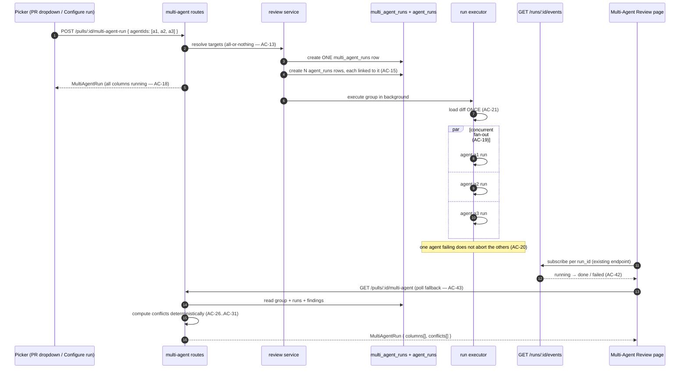
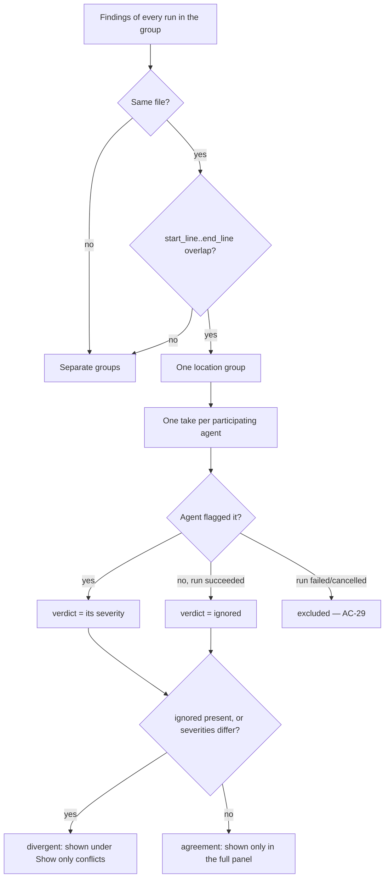

# Spec: Multi-Agent Review  |  Spec ID: SPEC-04  |  Status: draft
Supersedes: none
Implementation Plan: `specs/plans/PLAN-04-multi-agent-review.md`

> **Worktree-A scope boundary.** In scope: the Multi-Agent Review page (Configure
> run + results with Columns/Tabs + "Where agents disagree"), the agent picker on
> the PR page, the multi-run grouping (service, routes, schema linkage), and the
> client files those require. Out of scope and not to be touched: `ci/`,
> `agent-runner/`, the Per-Agent Stats feature, the cross-session memory curator,
> the "Compose Review" drawer, and any new trace/live-log UI.

## Проблема й навіщо

A real pull request is heterogeneous: one diff can move a security boundary,
change a hot loop, and rewrite domain rules at the same time. DevDigest today
makes the user pick **one lens at a time** — `RunReviewDropdown` offers exactly
"run this one agent" or "run every enabled agent", with no way to say "these
three". Covering a PR from several angles therefore means running reviews
repeatedly and mentally stitching the results together across separate review
runs on the Findings tab.

Three consequences follow, and this feature exists to fix all three:

1. **No single pass covers the PR.** The user wants a chosen *set* of
   specialists (security + performance + domain) on one PR, in one action.
2. **Duplicates destroy trust.** Three agents that independently flag the same
   obvious bug produce three identical-looking findings in three separate review
   blocks today. Reading the same thing three times, with nothing telling you
   it *is* the same thing, is how a reviewer starts distrusting the tool. The
   fix is not silent deduplication — it is making the overlap *legible*: one
   location, one group, one row per agent's verdict, **including the agents that
   reviewed and deliberately did not flag it**. That same view is what surfaces
   genuine disagreement (one agent says CRITICAL, another says nothing).
3. **A multi-minute run with no window is anxiety.** N agents on one PR is
   several minutes of staring at a spinner unless each agent's status
   (running / done / failed), duration and cost are visible *while* it happens.

A fourth, deliberately *deferred* motivation: per-finding agent attribution is
the raw material for a future "which of my agents is worth its money" answer
(Per-Agent Stats). This spec produces and preserves that attribution; it does
**not** build Per-Agent Stats.

### What already exists (grounding — verified in this tree, do not re-derive)

| Artifact | State | Location |
|---|---|---|
| `MultiAgentRun` / `AgentColumn` / `AgentColumnFinding` / `Conflict` / `ConflictTake` contracts (+ the endpoint names `POST /pulls/:id/multi-agent-run`, `GET /pulls/:id/multi-agent` in the file header) | ⚠️ defined, **zero producers/consumers** — no route, no client code | `server/src/vendor/shared/contracts/observability.ts:22-86`, mirrored at `client/src/vendor/shared/contracts/observability.ts` |
| `Conflict`'s match rule, already pinned in its own JSDoc: *"a file:line that at least one agent flagged and at least one other agent (that also reviewed) did NOT, OR where agents assigned divergent severities. Computed from persisted findings; not stored."* | ⚠️ documented, unimplemented | `observability.ts:61-72` |
| `AgentStats` / `StatPoint` / `CuratorMerge` / `CuratorResult` | ⚠️ reserved names for **other, out-of-scope** features | `observability.ts:88-140` |
| `multi_agent_runs` table `{id, workspace_id, pr_id, ran_at}` | ⚠️ exists, **fully unused**; **no FK/column anywhere links an `agent_runs` row to it** | `server/src/db/schema/runs.ts:44-53` |
| `RunRequest` = `{agentId?: string, all?: boolean}` — no way to submit an arbitrary subset | ✅ current behavior | `contracts/platform.ts:339-343`; parsed in `server/src/modules/reviews/routes.ts:34` |
| `ReviewService.resolveTargets` (`all` → `listEnabled`, else one agent, else 400) | ✅ extend point | `server/src/modules/reviews/service.ts:46-57` |
| `ReviewService.runReview` — creates one `agent_runs` row per target up front, returns run ids immediately, executes in the background (fire-and-forget) | ✅ **reuse** | `service.ts:103-138` |
| `ReviewRunExecutor.executeRuns` — loads the diff **once**, then runs each agent with per-agent failure isolation | ⚠️ **SEQUENTIAL, not parallel** — a plain `for (const {agent, runId} of jobs) { await this.runOneAgent(...) }` loop (`run-executor.ts:108-135`). There is **no worktree isolation anywhere in `server/src`** (grep: the only "worktree" mention is a `git reset --hard` comment in `adapters/git/simple-git.ts:79`). | `server/src/modules/reviews/run-executor.ts:56-136` |
| Per-run persistence already carries everything the columns need: `agent_runs.{status,duration_ms,cost_usd,error,score,findings_count,grounding}` | ✅ reuse | `server/src/db/schema/runs.ts:8-34` |
| SSE run events `GET /runs/:id/events` (replay buffer then live, ends on done) | ✅ **reuse as-is** | `server/src/modules/reviews/routes.ts:74-118` |
| `POST /findings/:id/accept` and `/dismiss` (the loop registers **only** these two; `learn`/`reply` exist in the `FindingActionKind` enum but have no route) | ✅ **reuse; do not add endpoints** | `routes.ts:20,169-175` |
| `RunTraceDrawer` — **the existing per-run detail sidebar**: `Drawer` with a Trace tab (Configuration / Stats / Prompt assembly / Tool calls / Raw output, incl. rejected grounding-gate findings and per-call cost, via `TraceBody`), a Live-log tab (`LiveLogStream` fed by `useRunEvents` SSE), and a footer **"Copy raw output"** action. Props: `{runId, agentName?, prNumber?, findings?, running?, onClose}`; **default** export. | ✅ **reuse — do not design a second one** | `client/src/app/repos/[repoId]/pulls/[number]/_components/RunTraceDrawer/RunTraceDrawer.tsx:19-107` |
| `useRunEvents(runIds[])` — subscribes to several runs' SSE streams in parallel; `usePrRuns`/`usePrActiveRuns` poll while anything is `running` | ✅ reuse | `client/src/lib/hooks/reviews.ts:28-48,168-216` |
| `RunReviewDropdown` — today: "Run all enabled agents" / one item per agent / "Configure agents…" → `/agents` | ⚠️ **to be replaced** by the multi-select picker | `client/.../_components/RunReviewDropdown/RunReviewDropdown.tsx` |
| `Agent.description: string` — the one-line "what this agent tends to find" the picker needs | ✅ reuse | `contracts/knowledge.ts:184-201` |
| `activeKeyFor` already returns `"multi-agent"` for any path containing `/multi-agent`, and `messages/en/shell.json`'s `nav["multi-agent"]` = "Multi-Agent Review" already exists | ✅ pre-written | `client/src/components/app-shell/helpers.ts:28`; `client/messages/en/shell.json:26` |
| **No sidebar NAV item for it** — `NAV` in `client/src/vendor/ui/nav.ts:21-39` has no `multi-agent` entry, and no page/route exists under `/multi-agent` | ❌ genuinely missing | `client/src/vendor/ui/nav.ts` |
| `Finding.{confidence (0..1), suggestion, rationale, start_line, end_line}` — the detail panel's confidence % and suggested fix; the line **range** the conflict grouping needs | ✅ reuse | `contracts/findings.ts:47-63` |
| Cross-agent dedup / grouping logic | ❌ does not exist anywhere in `reviewer-core` or `server` | — |

**Two grounding corrections to the source requirement doc** (surfaced, not
silently absorbed):
- *"Parallel execution already works."* It does **not**. `executeRuns` awaits each
  agent in sequence; only *failure isolation* is real. The verification script's
  "3 agents ≈ same wall-clock as 1" is therefore a **new requirement**
  (AC-19), not a property to inherit.
- *"Fan-out via worktrees."* No worktree mechanism exists; the diff is loaded once
  and shared across agents (AC-21). The results header must therefore not claim
  worktree isolation — the confirmed copy is **"parallel fan-out"** (AC-36).

## Goals / Non-goals

### Goals
- Let a user select an **arbitrary subset** of agents and start them on one PR in
  **one** action, from either the PR page dropdown or a dedicated Configure-run
  page.
- Show, before the run, a per-agent **time + cost estimate** derived from that
  agent's own last 5 workspace-wide runs — and an honest "—" when there is no
  history — plus a `max(time)` / `sum(cost)` aggregate for the selection.
- Group the resulting N `agent_runs` under **one** `multi_agent_runs` row, durably,
  so the group is re-readable after a reload or a server restart.
- Execute the group's runs **concurrently**, so N agents cost ~N× the money but
  ~1× the wall clock — and make both numbers visible.
- Stream **live per-agent status** (running → done/failed) into the results page
  without a reload, reusing the existing SSE endpoint.
- Render the group as **one page, two switchable modes** (Columns / Tabs+detail),
  both feeding the **existing** `RunTraceDrawer` for any per-run inspection.
- Make cross-agent overlap legible with a **"Where agents disagree"** panel:
  one group per shared code location, one row per participating agent —
  including "did not flag" — plus a "Show only conflicts" filter.
- Preserve **per-finding agent attribution** in the data as raw material for a
  later Per-Agent Stats feature.

### Non-goals (explicitly out of scope)
- **Producing an Implementation Plan.** This spec is WHAT/WHY only.
- **Redesigning the `MultiAgentRun`/`AgentColumn`/`Conflict`/`ConflictTake`
  shapes or the endpoint names.** They are fixed input, not a design space.
- **Per-Agent Stats** (`AgentStats`/`StatPoint`) and the **cross-session memory
  curator** (`CuratorResult`/`CuratorMerge`). Those reserved names stay
  unimplemented; this feature must not collide with them.
- **A new trace / live-log / run-detail UI.** Every per-run inspection path
  reuses `RunTraceDrawer` (which already contains Configuration, Stats, Prompt
  assembly, Copy-raw-output and the live-log toggle) and `LiveLogStream`.
- **Automatic deduplication or suppression of findings.** Duplicate findings stay
  visible in their own agents' columns; the disagreement panel makes the overlap
  legible rather than hiding it.
- **Semantic/embedding-based similarity, or any new LLM call.** Grouping is
  deterministic (see AC-26). The feature's only model spend is the selected
  agents' own review runs.
- **A concurrency cap / in-flight run limit.** Confirmed: all selected agents run
  at once, unbounded (AC-19). Throttling large selections is not built here.
- **The "Compose Review" drawer**, `ci/`, `agent-runner/`, and any
  GitHub-publishing path.
- **Backend endpoints for "Learn" and "Turn into eval case."** Both are stubs in
  this feature (AC-38).
- **Changing what a single agent run does** — no prompt, grounding-gate, or
  `reviewer-core` changes. This feature only chooses *which* agents run, runs them
  concurrently, groups them, and renders the group.
- **A multi-agent run history UI.** Confirmed latest-only: the page shows the
  **latest** group for a PR, served by `GET /pulls/:id/multi-agent` (AC-22).
  Earlier groups remain in the database and are not deleted, but browsing them is
  explicitly out of scope here — a group-history/compare view is a **future
  extension**, deferred rather than omitted.

## User stories

- **US-1 (reviewer, one pass).** As a reviewer on a heterogeneous PR, I tick
  Security, Performance and Domain in one dropdown and hit "Run multi-agent
  review (3)", so one action covers every angle I care about.
- **US-2 (reviewer, budget-aware).** As a reviewer, I see each agent's typical
  time and cost *before* I start, and a total, so I choose a set knowing roughly
  what I'm spending.
- **US-3 (reviewer, live).** As a reviewer waiting on a multi-minute run, I watch
  each agent's column flip from running to done (or failed) as it finishes,
  instead of staring at one undifferentiated spinner.
- **US-4 (reviewer, trust).** As a reviewer, when several agents land on the same
  line I see one grouped row per location — who flagged it, at what severity, and
  who reviewed it and said nothing — instead of three near-identical findings in
  three places.
- **US-5 (reviewer, conflict triage).** As a reviewer, I flip "Show only
  conflicts" to see just the locations where my agents *disagree*, because those
  are the ones worth my judgement.
- **US-6 (reviewer, act).** As a reviewer, I open a finding's detail, read its
  confidence and suggested fix, and Accept or Dismiss it without leaving the page.
- **US-7 (operator, audit).** As an operator, I open any agent's run from the
  multi-agent page and land in the existing run sidebar — prompt blocks with token
  counts, grounding-gate rejections with reasons, per-call cost — so I can answer
  "why did this finding cost this much" and "what got rejected".
- **US-8 (skeptic).** As a user comparing 1-agent vs 3-agent runs on the same PR,
  I can see that wall-clock stayed roughly flat while cost roughly tripled — the
  honest trade this feature makes.

## Acceptance criteria (EARS)

### A. Agent picker — PR page dropdown

- **AC-1** WHEN a user opens the run-review dropdown on the PR page, the system
  **shall** render a multi-select checklist with one checkbox row per agent
  (name, icon, and that agent's estimate per AC-8/AC-9), a primary
  **"Run multi-agent review (N)"** action whose N is the number of currently
  checked agents, and a **"Configure agents…"** item that navigates to the
  Multi-Agent Review → Configure run page. *Verify: unit (RTL).*
- **AC-2** The dropdown **shall** replace the current one-agent / all-agents
  item behavior: selecting agents no longer starts a run on click, and the run
  starts only from the primary action. *Verify: unit.*
- **AC-3** WHILE zero agents are checked, the system **shall** render the primary
  action as non-actionable and **shall not** issue any run request. *Verify: unit.*
- **AC-4** WHEN the user activates "Run multi-agent review (N)", the system
  **shall** issue **exactly one** HTTP request carrying all N selected agent ids —
  not one request per agent. *Verify: unit (mocked fetch: one call, N ids).*
- **AC-45** WHEN a multi-agent run is started from the **PR page** picker, the
  system **shall** navigate the user to the Multi-Agent Review results page for
  that group — the same destination the Configure-run flow lands on — so both
  entry points converge on one results UI. *Verify: unit/e2e.*
  *(Appended after AC-44: AC ids are append-only, so a criterion added to an
  earlier section keeps the next free number rather than renumbering the rest.)*

### B. Configure-run page + navigation

- **AC-5** The system **shall** expose a "Multi-Agent Review" sidebar entry whose
  NAV `key` is exactly `multi-agent`, matching both `activeKeyFor`'s existing
  return value and the existing `nav.multi-agent` message key. *Verify: unit
  (string equality across NAV item, `activeKeyFor`, messages).*
- **AC-6** WHILE no PR has been selected on the Configure-run page, the system
  **shall** render step 1 (PR picker) with step 2 (agent checklist) in a disabled
  empty state, and **shall not** offer the run action. *Verify: unit/e2e.*
- **AC-7** WHEN a PR is selected, the system **shall** render one checklist row
  per agent showing checkbox, icon, name, the agent's existing `description`
  one-liner, and its time+cost estimate; a **Select all** affordance; a
  **"Run multi-agent review (N)"** action; and, beneath it, an aggregate estimate
  line. *Verify: unit/e2e.*

### C. Pre-run estimates

- **AC-8** The system **shall** compute an agent's time and cost estimate as the
  average of that agent's **last 5 completed runs across the whole workspace**
  (any PR, any repo), read from persisted run records — with **zero** LLM calls.
  WHERE an agent has fewer than 5 completed runs, the average **shall** be taken
  over however many exist (see AC-9 for the zero case). *Verify: unit.*
- **AC-9** IF an agent has no completed run in the workspace, THEN the system
  **shall** display `—` for that agent's estimate and **shall** exclude it from the
  aggregate line, rather than substituting a global default or a fabricated
  figure. *Verify: unit.*
- **AC-10** The aggregate estimate line **shall** be computed as
  **`max(duration estimate)` over the selected agents** (they run concurrently, so
  wall-clock tracks the slowest one) and **`sum(cost estimate)` over the selected
  agents** (every agent is paid for), rendered together with a parallel-fan-out
  label (e.g. "≈ 8.2s · $0.20 · parallel fan-out"). It **shall not** sum durations
  or take a maximum of costs. *Verify: unit.*

### D. Kick-off, grouping and tenancy

- **AC-11** The system **shall** accept an arbitrary subset of agents in one
  request by extending `RunRequest` with `agentIds: string[]`, alongside the
  existing `agentId` and `all` fields. *Verify: integration.*
- **AC-12** The system **shall** keep the existing `{agentId}` and `{all: true}`
  request behavior of `POST /pulls/:id/review` working unchanged for non-UI
  callers (MCP server, pre-push CLI, CI). *Verify: integration.*
- **AC-13** IF a request names an agent id that does not exist in the caller's
  workspace, THEN the system **shall** reject the whole request with a 4xx and
  **shall not** create a multi-agent-run row or start any agent run (all-or-nothing).
  *Verify: integration.*
- **AC-14** IF a request supplies none of `agentIds`, `agentId` or `all` (or an
  empty `agentIds`), THEN the system **shall** reject it with the existing 400
  `invalid_run_request` behavior. *Verify: integration.*
- **AC-15** WHEN a multi-agent run is started, the system **shall** create exactly
  one `multi_agent_runs` row and durably link every agent run it started to that
  row, so the grouping is reconstructible after a page reload or a server restart.
  *Verify: integration.*
- **AC-16** The system **shall** scope both multi-agent endpoints to the caller's
  workspace, such that a multi-agent run belonging to another workspace is not
  readable through them. *Verify: integration.*
- **AC-17** The multi-agent kick-off route **shall** carry a per-route rate limit
  at least as strict as the existing `POST /pulls/:id/review` limit (10 / minute),
  since one call fans out to N paid LLM runs. *Verify: manual/source check — a
  route-level rate limit is behaviorally unobservable under `NODE_ENV=test` in
  this repo.*
- **AC-18** WHEN the kick-off request is accepted, the system **shall** respond
  immediately with the `MultiAgentRun` document (all columns in `running`),
  without waiting for any agent to finish. *Verify: integration.*

### E. Concurrent execution and failure isolation

- **AC-19** WHEN a multi-agent run's agents execute, the system **shall** run
  **every** selected agent concurrently, with **no cap on in-flight runs**, such
  that the group's wall-clock is bounded by the slowest agent rather than by the
  sum of all agents' durations — a selection of 10 agents starts 10 concurrent
  runs. *Verify: integration (mock LLM with per-agent delays; assert total ≈ max,
  not Σ, and that N runs are in flight simultaneously).*
- **AC-20** IF one agent's run fails, is cancelled, or times out, THEN the system
  **shall** let every other run in the group continue to completion, **shall** mark
  only that agent's column as failed, and **shall** keep the group readable with
  the failure reason available. *Verify: integration.*
- **AC-21** The system **shall** perform the shared pre-work (diff load) once per
  group and reuse it for every agent in that group, rather than once per agent.
  *Verify: unit/integration (one diff load per group).*

### F. Multi-agent read model

- **AC-22** The system **shall** serve the latest multi-agent run for a PR as the
  existing `MultiAgentRun` document — `{id, pr_id, pr_number, ran_at,
  agent_count, total_duration_ms, total_cost_usd, columns[], conflicts[]}` — with
  one `AgentColumn` per agent in the group, without altering those shapes.
  *Verify: integration (response parses against the existing Zod contract).*
- **AC-23** The system **shall** map persisted run status onto the contract's
  three-value `AgentColumn.status` as: `done` → `done`; `running` → `running`;
  `failed` **and** `cancelled` → `failed` (the contract has no cancelled variant),
  with the cancellation/failure reason preserved for display. *Verify: unit.*
- **AC-24** WHILE at least one run in the group is still `running`, the system
  **shall** still return the full document, reporting `total_duration_ms` as the
  wall-clock elapsed since the group started and `total_cost_usd` as the sum of
  the per-run costs known so far (`null` when none is known yet) — it **shall
  not** block until the group completes. *Verify: integration.*
- **AC-25** Every finding surfaced in the document **shall** carry the id of the
  agent that produced it, so per-finding attribution is queryable by a later
  feature. *Verify: unit.*

### G. "Where agents disagree" — cross-agent grouping

- **AC-26** The system **shall** compute location groups **deterministically** from
  persisted findings, with zero LLM and zero embedding calls, and **shall not**
  persist them (they are derived per read, per the `Conflict` contract's own
  JSDoc). *Verify: unit.*
  *(Scope of the emitted set: AC-46. Divergence classification: AC-30.)*
- **AC-27** The system **shall** group two findings from **different** agents in
  the same multi-agent run into the same location group WHEN they name the same
  file AND their `[start_line, end_line]` ranges overlap. *Verify: unit.*
- **AC-46** The system **shall** emit **every** cross-agent location group into
  `MultiAgentRun.conflicts[]` — including groups where every participating agent
  flagged the location at the **same** severity (full agreement) — not only the
  divergent ones. This **deliberately widens** the set beyond the literal wording
  of the `Conflict` contract's JSDoc ("at least one agent flagged and at least one
  other did NOT, OR divergent severities") while keeping the **exact same shape**:
  no field is added, removed or retyped, and the widening is what gives AC-30's
  "Show only conflicts" filter something to filter. *Verify: unit (a
  same-severity-everywhere group is present in `conflicts[]`).*
  *(Appended after AC-45 — see the append-only note there.)*
- **AC-28** For each location group, the system **shall** emit one `ConflictTake`
  per agent that **participated** — the take's `verdict` being that agent's
  severity when it flagged the location, and `'ignored'` when it reviewed the PR
  successfully and did not flag it. *Verify: unit.*
- **AC-29** IF an agent's run in the group failed or was cancelled, THEN that agent
  **shall not** be given an `'ignored'` take in **any** group of the widened set
  (it never got the chance to look) — it is excluded from that group's takes, so a
  failed run can never make a group look like agreement or like a "did not flag"
  verdict. *Verify: unit.*
- **AC-30** The system **shall** classify a location group as *divergent* WHEN its
  takes contain an `'ignored'` alongside at least one severity, OR two different
  severities (the `Conflict` JSDoc rule); and WHEN "Show only conflicts" is
  enabled, the client **shall** filter the widened `conflicts[]` set (AC-46) down
  to exactly the divergent groups, hiding full-agreement groups. WHILE the toggle
  is off, the panel **shall** show every group in the set. *Verify: unit.*
- **AC-31** The system **shall** derive each group's `line` as the lowest
  `start_line` among the group's findings, its `title` from the highest-severity
  finding in the group, and each take's `persona` from the producing agent's name
  (no persona field exists on an agent) — all deterministic, with no free-text
  invention. *Verify: unit.*
- **AC-32** WHERE a take's verdict is `'ignored'`, the client **shall** render a
  localized "did not flag" label from the verdict itself, so no user-facing copy is
  produced server-side (i18n rule per `client/AGENTS.md`). *Verify: unit.*

### H. Results page — Columns / Tabs / header

- **AC-33** The Multi-Agent Review results page **shall** offer a view-mode toggle
  between **Columns** and **Tabs**, rendering the selected mode over the same
  underlying group data. *Verify: unit/e2e.*
- **AC-34** WHERE Columns mode is active, the system **shall** render one column
  per agent whose header shows live status (running / done / failed), duration,
  cost and a **View trace** affordance, with that agent's findings listed beneath
  ordered by severity (CRITICAL → WARNING → SUGGESTION). *Verify: unit/e2e.*
- **AC-35** WHERE Tabs mode is active, the system **shall** render one tab per
  agent, and WHEN a finding is selected **shall** show a detail panel containing
  its confidence (as a percentage of the existing 0..1 `confidence`), its
  suggested fix, and the actions Accept / Dismiss / Learn / Turn into eval case.
  *Verify: unit/e2e.*
- **AC-36** The results page header **shall** show the group's agent count, total
  duration, total cost, and a parallel-fan-out label. *Verify: unit/e2e.*
- **AC-37** WHEN the user activates **Accept** or **Dismiss** on a finding, the
  system **shall** call the existing `POST /findings/:id/accept` /
  `POST /findings/:id/dismiss` endpoints and **shall not** introduce new
  finding-action endpoints. *Verify: unit (mocked fetch asserts the existing paths).*
- **AC-38** The system **shall** render **Learn** and **Turn into eval case** in a
  disabled state with an explanatory "coming soon" hover/tooltip referencing the
  future Memory and eval work, and activating them **shall** issue no request.
  *Verify: unit.*

### I. Per-run inspection — reuse the existing sidebar

- **AC-39** WHEN the user activates **View trace** in Columns mode, or the
  run-detail affordance in Tabs mode, the system **shall** open the **existing**
  `RunTraceDrawer`
  (`client/src/app/repos/[repoId]/pulls/[number]/_components/RunTraceDrawer/RunTraceDrawer.tsx`)
  for that agent's `run_id`, passing the agent name and the run's live state — so
  the user gets that component's existing Configuration / Stats / Prompt-assembly /
  Tool-calls / Raw-output sections, its Copy-raw-output action, and its live-log
  toggle. The feature **shall not** introduce a second run-detail sidebar, trace
  view, or log view. *Verify: unit (the multi-agent page mounts that component,
  not a new one) + e2e.*
- **AC-40** WHILE an agent's run is still in flight, the drawer opened from the
  multi-agent page **shall** default to its existing live-log view (SSE via the
  existing `LiveLogStream`), and after completion **shall** show the persisted
  trace — reusing the drawer's existing `running` behavior unchanged. *Verify: e2e.*
- **AC-41** The duration and cost shown in an agent's column/tab header **shall**
  come from that run's persisted run record — the same source the drawer's Stats
  section reads — so a user auditing "why did this cost this much" sees consistent
  figures in both places. *Verify: unit.*

### J. Live status

- **AC-42** WHILE a group's runs are in flight, the system **shall** update each
  agent's column/tab status from running to done or failed **without a page
  reload**, driven by the existing `GET /runs/:id/events` SSE stream. *Verify: e2e.*
- **AC-43** IF the SSE stream drops or is unavailable, THEN the page **shall** still
  converge to the terminal per-agent statuses via the existing polling read path,
  rather than remaining stuck on "running". *Verify: unit/integration.*
- **AC-44** WHEN every run in the group has reached a terminal state, the system
  **shall** render the "Where agents disagree" panel over the completed group and
  stop polling. *Verify: unit/e2e.*

## Edge cases

- **One agent selected.** A one-agent "multi-agent" run is legal: a group of one,
  one column, no conflicts (a location needs ≥2 participating agents). It is also
  the baseline for the 1-vs-3 comparison in US-8.
- **All agents fail.** The group is still readable: every column `failed` with its
  reason, `conflicts` empty (no participating agents), aggregate cost possibly
  `null`.
- **Mixed success/failure.** Only successful agents get `'ignored'` takes (AC-29) —
  a failed agent must never be reported as "reviewed and chose not to flag".
- **An agent is disabled after selection but before/while running.** The run
  proceeds; selection is an explicit user act (the current dropdown already lets a
  disabled agent be run individually).
- **A run is cancelled mid-group.** Mapped to `failed` in the column (AC-23) with
  "cancelled" as its reason; siblings continue (AC-20).
- **Duplicate agent ids in `agentIds`.** Treated as one selection; the group must
  not contain two runs of the same agent from one request.
- **Findings on the same file with adjacent but non-overlapping ranges** (e.g.
  10–12 and 13–15) do **not** group — deliberately, since the rule is overlap, not
  proximity. This under-groups rather than falsely merging distinct issues.
- **Two findings from the *same* agent at the same location.** Both stay in that
  agent's column; a location group only compares *across* agents, and one agent
  contributes one take (its highest-severity finding there).
- **A PR with no findings from anyone.** Columns render empty; the disagreement
  panel renders an explicit empty state, not an error.
- **Very large PR / many findings.** The grouping is pairwise over one group's
  findings — see Non-functional for the bound.
- **PR deleted while a group exists.** `multi_agent_runs.pr_id` already cascades
  on PR delete; the group disappears with the PR.
- **Estimates with fewer than 5 prior runs.** The average is taken over however
  many completed runs exist (AC-8); with one run it degenerates to that run. Only
  *zero* history yields `—` (AC-9).
- **Second multi-agent run started on the same PR.** A new group row is created and
  the page shows that latest group (AC-22); the earlier group stays in the database
  but is not browsable in this feature.
- **Provider rate-limits under concurrent fan-out.** Because there is no
  concurrency cap (AC-19), N simultaneous provider calls can trip a provider quota
  that N sequential ones would not. Each affected run fails independently and the
  rest of the group completes (AC-20). This is an **accepted** trade for the
  flat-wall-clock guarantee, not an open gap: the route-level rate limit (AC-17)
  bounds how often a group can be started, not how wide one group fans out.

## Non-functional

- **Performance.** The whole promise is *latency-flat, cost-linear*: N agents
  should cost ~N× tokens/dollars but ~1× wall clock (AC-19), with the shared diff
  load done once per group (AC-21). Both figures must be visible per run and in
  aggregate (AC-34, AC-36, AC-41) so the trade is auditable rather than asserted.
  The read path must never block on in-flight runs (AC-24). Conflict computation is
  pairwise across the group's findings and runs on every read (AC-26) — it must
  stay bounded on a large PR (a findings-per-group cap, or grouping by file first,
  is an implementation-planner decision), and it introduces **zero** new model
  spend. Concurrency is deliberately **unbounded** (AC-19): every selected agent
  runs at once, so a wide selection gets no in-feature throttling — accepted, with
  the consequence recorded under Edge cases.
- **Security.** Consult the `security` skill. The new kick-off route is a
  cost-amplifying endpoint — one call starts N paid LLM runs — so it must carry at
  least the existing review route's rate limit (AC-17) and reject unknown agent ids
  all-or-nothing (AC-13). Both endpoints are workspace-scoped through the existing
  request-context guard, and a bare group id must never be trusted for tenancy
  (AC-16) — the same trap already recorded for batch ids elsewhere in this repo.
  No new secrets, no new outbound calls, no new write scopes. See **Untrusted
  inputs** for the prompt-injection surface (unchanged in size, but re-rendered in
  a new place).
- **Accessibility (client).** Per-agent status (running / done / failed) and
  severity must not be conveyed by colour alone — each needs a text or icon cue.
  The agent checklists must be fully keyboard-operable, and the checked count must
  be announced in the run action's accessible name ("Run multi-agent review, 3
  agents selected"). Disabled **Learn** / **Turn into eval case** buttons need a
  programmatically associated explanation, not a hover-only tooltip (AC-38).
  Columns mode must remain usable at narrow widths (reflow/scroll rather than
  clipping) with 3+ agents. All user-facing copy goes through next-intl (AC-32).
- **Observability.** Each run in a group must be traceable to its group and its
  agent: log the group id, PR id, selected agent set, and per-run start/finish
  with status, duration, cost and failure reason. Existing per-run traces
  (prompt blocks with token counts, grounding-gate rejections, per-call cost)
  remain the audit surface and are reached through the existing drawer (AC-39) —
  no new observability UI. A group whose runs are all terminal but whose aggregate
  cost is `null` should be distinguishable in logs from a group that genuinely
  cost nothing.

## Workflow & Contracts

### Kick-off → concurrent fan-out → grouped read

### Location grouping ("Where agents disagree")

### Contracts

- **Fixed, reused verbatim** (`contracts/observability.ts`, both vendored copies):
  `MultiAgentRun`, `AgentColumn`, `AgentColumnFinding`, `Conflict`, `ConflictTake`,
  and the endpoint names `POST /pulls/:id/multi-agent-run` and
  `GET /pulls/:id/multi-agent`. No field may be added, removed or retyped here.
- **Reserved, untouched:** `AgentStats`, `StatPoint`, `CuratorMerge`,
  `CuratorResult` — other features own these names.
- **Extended:** `RunRequest` gains `agentIds: string[]` (optional) next to the
  existing optional `agentId` / `all` (AC-11), in **both** vendored copies by hand
  (`server/src/vendor/shared/**` covers server + `reviewer-core`;
  `client/src/vendor/shared/**` is the client's own copy).
- **New (small, must not collide with `AgentStats`):** a pre-run estimate shape
  carrying, per agent, an average duration and average cost that are **nullable**
  to express "no history" (AC-9), plus the endpoint that serves it. This is
  deliberately *not* `AgentStats`, which belongs to the out-of-scope Per-Agent
  Stats feature. Exact naming/shape is an implementation-planner decision.
- **Data linkage:** `multi_agent_runs` already exists; the feature must add the
  durable association from N `agent_runs` rows to one group row (AC-15). Whether
  that is a nullable column on `agent_runs` or a join table is an
  implementation-planner decision; the requirement is only that the grouping
  survives restart and is queryable by PR.
- **Detail-panel data source.** `AgentColumnFinding` deliberately carries only
  `{id, severity, category, title, file, start_line, kind}` — it has **no**
  `confidence`, `rationale` or `suggestion`. The Tabs-mode detail panel (AC-35)
  must therefore read those from the existing persisted-findings read path
  (`GET /pulls/:id/reviews`), not by widening `AgentColumnFinding`.
- **Client reuse, by path:** `RunTraceDrawer`
  (`client/src/app/repos/[repoId]/pulls/[number]/_components/RunTraceDrawer/RunTraceDrawer.tsx`,
  **default** export, props `{runId, agentName?, prNumber?, findings?, running?,
  onClose}`) and, through it, `LiveLogStream` (`client/src/vendor/ui/LiveLogStream.tsx`)
  and `useRunEvents` (`client/src/lib/hooks/reviews.ts`). The drawer currently lives
  under the PR-detail route folder; making it reachable from a `/multi-agent` page
  is an import/relocation question for the implementation planner — the
  requirement is that it is the **same component**, not a copy.
- **Nav:** a NAV entry must be added to `client/src/vendor/ui/nav.ts` with `key:
  "multi-agent"` (the message key and `activeKeyFor` branch already exist and must
  match it exactly — mismatched near-miss keys have silently broken highlighting
  and thrown missing-message errors in this codebase before).

## Inputs (provenance)

- Agent roster, names, descriptions, enabled flags — **[deterministic: existing
  agents read path]**.
- Pre-run time/cost estimates — **[deterministic: aggregate over persisted
  `agent_runs` history, workspace-wide, last N completed]**; no model call.
- Findings, verdicts, scores, durations, costs, grounding summaries — **[reused:
  N LLM calls, one per selected agent — the existing single-agent review
  pipeline, unchanged]**. This feature adds **zero** LLM calls of its own.
- Location groups / conflicts — **[deterministic: pairwise file + line-range
  overlap over persisted findings, computed per read, not stored]**.
- Live per-agent status — **[reused: existing SSE run-event stream + existing
  polling read path]**.
- Per-run trace, prompt blocks, token counts, grounding-gate rejections —
  **[reused: existing `RunTraceDrawer` / run-trace document]**.
- Group membership and aggregates — **[deterministic: DB read/write]**.

## Untrusted inputs

The findings this page renders are **LLM output about attacker-influenceable
input** (a PR diff, its title/body, and repo content anyone who can land a commit
controls). Titles, rationales and suggested fixes are therefore untrusted text,
and this feature puts them in front of the reviewer in two *new* places (columns/
tabs and the disagreement panel) alongside a set of one-click actions.

Consequences and mitigations (consult the `security` skill):
- **Treat all finding text as data, never as instructions or markup.** It is
  rendered through the existing findings-rendering path and must not be injected
  as raw HTML, nor used to construct any command, URL or request. No field of a
  finding may drive navigation or an automatic action.
- **No new prompt-injection surface is created**, because this feature makes no
  LLM call: the grouping is deterministic (AC-26) and no finding text is ever fed
  back into a model here. Had similarity been computed by a model, crafted finding
  text could have steered which findings were merged or hidden — one more reason
  the grouping stays deterministic.
- **Grouping must not be steerable by content.** Groups are keyed on file path and
  line ranges from the already-grounded findings, not on model-authored prose, so a
  crafted title cannot merge two unrelated locations or split a real overlap.
- **`'ignored'` is a claim about a run, not about text.** It is derived from run
  status plus the absence of a finding (AC-28/AC-29), never from anything the model
  wrote, so no crafted output can make an agent appear to have "cleared" a
  location it never reviewed.
- **Cost amplification is the abuse vector to bound**, not content: rate limiting
  (AC-17) and all-or-nothing validation (AC-13) exist because one request now
  starts N paid runs.
